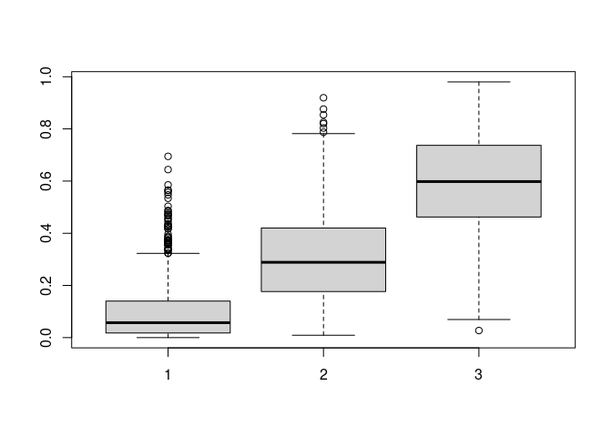

<!-- README.md is generated from README.Rmd. Please edit that file -->

## Installation

<!-- badges: start -->
<!-- badges: end -->

You can install the development version of disaggR from
[GitHub](https://github.com/) with:

``` r
# install.packages("devtools")
devtools::install_github("simschul/disaggR")
```

Note, this package is under constant development. Together with
co-authors, I’m currently preparing a journal article for describing
more of the background of data disaggregation and showing use cases
within the field of Industrial Ecology.

## Background: Uncertainty propagation involving data disaggregation

The goal of disaggR is an R-package that helps you with uncertainty
propagation when data disaggregation is involved. Data disaggregation
usually involves splitting one data point into several disaggregates
using proxy data. It is a common problem in many different research
disciplines.


Data disaggregation usually involves an aggregate flow $Y_0$, which is
known, such as the total amount of steel manufactured in a given time
and geography. What we do not know but are interested in are the $K$
disaggregate flows $Y_1,...,Y_K$, such as the different end-use sectors
where the manufactured steel ends up. Even though we do not know the
values of $Y_1, ..., Y_K$, our model structures commonly demands that
the individual $Y_i$’s need to sum to the known aggregate flow $Y_0$ to
respect the mass, energy, stoichiometric or economic balance of the
model

$$
  Y_0 = \sum_{i=1}^{K} Y_i 
$$

This equation, also called an *accounting identity* introduces
dependencies/correlations between the individual disaggregate flows
$Y_i$.

To get estimates for the disaggregate flows, one usually looks for proxy
data. Those proxy data are used to calculate shares (ratios/fractions)
of the respective disaggregate units $\alpha_1, ..., \alpha_K$. To
allocate the entire aggregate flow without leaving any residual (thus to
respect the system balance), those fractions need to sum to one:

$$    \sum_{i=1}^{K} \alpha_i = 1 $$

Disaggregate flows are calculated as

$$ y_i = \alpha_i y_0,  \forall i \in \{1,...,K\}.     $$

## Sampling disaggregates

This package generates a random sample of disaggregates based on the
information provided. The aggregate and the shares are sampled
independently. The distribution from which to sample is determined
internally based on the information provided by the user. This choice of
distribution is mostly based on the principle of Maximum Entropy
(MaxEnt).

The aggregate distribution is determined using the following decision
tree:


The shares are sampled from different variants of the Dirichlet
distribution:


## How to use

### Sampling disaggregates

The main function is `rdisagg` which creates a random sample of
disaggregates based on the information provided:

``` r
library(disaggR)
#> Loading required package: truncnorm
#> Loading required package: nloptr
#> Loading required package: gtools
#> Loading required package: data.table
#> 
#> Attaching package: 'disaggR'
#> The following object is masked from 'package:gtools':
#> 
#>     rdirichlet
sample <- rdisagg(n = 1000, mean_0 = 100, sd_0 = 5, min = 0, shares = c(0.1, 0.3, 0.6))
head(sample)
#>           [,1]      [,2]     [,3]
#> [1,]  9.078659 29.484181 61.36315
#> [2,]  5.797168  7.529133 84.08439
#> [3,] 45.707375 37.544960 15.31487
#> [4,]  8.006481 22.593471 66.01442
#> [5,] 19.182876 23.522120 56.44000
#> [6,] 11.539340 39.168450 54.49299
```

We can plot the marginal histograms of the sample:

``` r
hist(sample[,1])
```


``` r
hist(sample[,2])
```


``` r
hist(sample[,3])
```


The samples are consistent with all information provided. Thus, summing
the disaggregate samples should provide an aggregate sample consistent
with the information provided (mean: 100, sd: 5):

``` r
sample_agg <- rowSums(sample)
hist(sample_agg)
```


And indeed:

``` r
cat('Mean: ', mean(sample_agg), '\n')
#> Mean:  99.83257
cat('SD: ', sd(sample_agg))
#> SD:  4.983519
```

### Sampling aggregates and shares seperatedely

With `disaggR` you can also sample the aggregate and the shares
independently using the `ragg` and `rshares` functions:

``` r
sample_agg <- ragg(1000, mean = 100, sd = 5)
hist(sample_agg)
```


``` r
sample_shares <- rshares(1000, shares = c(0.1, 0.3, 0.6))
boxplot(sample_shares)
```



### Different scenarios of information available

TODO

``` r
rdisagg(n = 1000, mean_0 = 100, sd_0 = 5, min = 0, shares = c(0.1, 0.3, 0.6))
#>                 [,1]       [,2]       [,3]
#>    [1,] 8.286565e+00 18.1308162  65.227029
#>    [2,] 1.177560e+01 41.2654249  46.795865
#>    [3,] 2.666314e+01 13.8931520  56.967090
#>    [4,] 1.014041e+01 47.7571750  37.548218
#>    [5,] 3.783922e+01 19.1112697  48.055881
#>    [6,] 9.081596e-01 40.0563398  62.303192
#>    [7,] 1.805552e+01 13.3678824  71.694702
#>    [8,] 5.368089e-01 30.6428690  70.181263
#>    [9,] 4.322385e-01  8.2682377  87.888271
#>   [10,] 4.656567e+01 28.5455951  23.620305
#>   [11,] 9.615827e-02 67.0879885  29.702863
#>   [12,] 8.277971e+00 23.7373878  66.692754
#>   [13,] 1.579441e+01 22.1163770  56.036314
#>   [14,] 2.774664e+00 25.9834830  67.288845
#>   [15,] 4.350859e+00 18.0559789  68.249789
#>   [16,] 1.738848e+00 40.2033447  59.226478
#>   [17,] 8.877746e-02 17.8133337  80.062891
#>   [18,] 3.297723e+00 21.6085450  69.602666
#>   [19,] 6.050039e-02 33.3642652  58.396856
#>   [20,] 7.759509e+00 56.6935497  35.301150
#>   [21,] 5.002762e+00  7.6505305  85.535082
#>   [22,] 5.022716e+00 62.3587317  34.007982
#>   [23,] 7.616771e+00 34.2016328  54.493161
#>   [24,] 1.556525e+01 32.8711874  54.294919
#>   [25,] 9.671963e+00 30.4339314  58.696592
#>   [26,] 6.866259e-01 51.3744752  59.629133
#>   [27,] 1.896120e-01 63.5164531  37.576554
#>   [28,] 7.539646e+00 41.3811890  46.537872
#>   [29,] 5.470817e-01 13.9739460  78.454083
#>   [30,] 3.634824e+01 18.6085042  41.398058
#>   [31,] 1.230402e+01 71.3236379  21.565495
#>   [32,] 9.700483e+00 56.9295720  43.262838
#>   [33,] 3.376273e+00 58.0884797  42.795670
#>   [34,] 8.827945e-01 28.8382366  78.538887
#>   [35,] 7.286765e+00 52.6047991  40.640696
#>   [36,] 4.085784e+00 52.2307389  37.986821
#>   [37,] 3.685631e+00 37.4985913  59.584179
#>   [38,] 2.858787e+00 10.0500112  87.715797
#>   [39,] 2.922237e-01 31.5374068  65.227909
#>   [40,] 1.000407e+01 24.6457792  67.949880
#>   [41,] 3.656901e+01 10.7150417  43.262242
#>   [42,] 8.695793e-01 20.7666527  80.398139
#>   [43,] 1.399821e+00 18.6745973  74.035381
#>   [44,] 6.288190e+00 26.7638987  63.274131
#>   [45,] 2.041667e+01 16.1337001  67.190051
#>   [46,] 4.001635e+00 43.5568538  54.392388
#>   [47,] 7.797038e-01 41.2737399  60.248219
#>   [48,] 6.826691e-01 34.4135072  68.564353
#>   [49,] 2.816217e+00 11.0851240  84.887377
#>   [50,] 4.455109e+01 25.9400980  32.120331
#>   [51,] 3.558607e+01 38.4097344  18.823729
#>   [52,] 2.129047e+01 14.0776314  77.214975
#>   [53,] 6.459300e-01 58.9143523  45.569781
#>   [54,] 4.875364e+01 22.3606332  37.342616
#>   [55,] 2.809362e+00 31.0115800  70.015843
#>   [56,] 2.594900e+00 39.9755739  60.346623
#>   [57,] 5.212498e+00 47.1109580  47.134859
#>   [58,] 9.855098e+00 64.0382280  25.355492
#>   [59,] 7.228689e+00 51.3239796  43.337056
#>   [60,] 8.229661e-01 14.1980467  90.753077
#>   [61,] 1.246255e+01 18.3865000  75.946834
#>   [62,] 1.279804e+01 17.1452920  76.675815
#>   [63,] 2.595315e+00 18.0810656  82.056817
#>   [64,] 4.696195e+00 46.2335415  53.868051
#>   [65,] 1.733631e-02 36.7106135  74.873612
#>   [66,] 5.846388e-01 13.1731292  82.918309
#>   [67,] 3.017856e+01 26.8276906  46.147774
#>   [68,] 2.847059e+00 18.1087898  85.077376
#>   [69,] 3.264947e+00 63.0080364  32.920242
#>   [70,] 3.844460e+00 31.5244393  63.767418
#>   [71,] 1.207646e+01 33.9487831  40.993263
#>   [72,] 1.274775e+01 17.8976822  62.685524
#>   [73,] 1.646709e+01 59.4624571  14.887208
#>   [74,] 7.319741e+00 36.5104438  53.197501
#>   [75,] 5.033121e+00 20.5105252  69.811438
#>   [76,] 3.649663e+00 44.8511331  42.378356
#>   [77,] 2.096459e+01 22.1958448  52.149003
#>   [78,] 4.617938e+00 68.6790160  24.385233
#>   [79,] 5.311443e+00 65.2084469  39.597896
#>   [80,] 5.729974e+00 72.3779764  27.918749
#>   [81,] 1.673074e+01  2.3878257  78.135166
#>   [82,] 2.074381e+00 28.8409952  65.523461
#>   [83,] 2.240192e+00 18.1459555  71.107133
#>   [84,] 1.353105e+01 31.6959088  48.634757
#>   [85,] 4.301016e-01 48.9674672  55.693346
#>   [86,] 1.306715e+01 38.7230574  48.097872
#>   [87,] 4.236163e-01 33.8808711  73.466309
#>   [88,] 1.585491e-01 16.6698141  89.275771
#>   [89,] 9.641130e+00 21.2182293  60.638372
#>   [90,] 6.693786e-01 51.9011691  53.721051
#>   [91,] 4.625978e+00 20.1869077  73.980593
#>   [92,] 5.460647e+00 10.7352625  88.297349
#>   [93,] 2.096891e+00 19.1051591  69.986870
#>   [94,] 2.827519e+01  9.6997482  57.468617
#>   [95,] 2.302761e+00 22.3858348  82.111281
#>   [96,] 4.093365e+00 21.0871745  71.757062
#>   [97,] 5.153208e+00 11.4630552  85.988231
#>   [98,] 5.317129e+00  5.6216947  92.991171
#>   [99,] 2.579687e+00 49.1783855  46.124439
#>  [100,] 3.242269e+00 52.6064683  47.703485
#>  [101,] 3.053886e+01 30.7172520  44.914490
#>  [102,] 7.320085e+00 20.6535592  67.982366
#>  [103,] 5.545940e+01 15.5271376  29.547811
#>  [104,] 3.162379e+00 33.0784401  56.518537
#>  [105,] 9.242755e+00 23.0860004  73.351209
#>  [106,] 8.820278e-01 15.2987459  80.002458
#>  [107,] 3.809089e+00 21.2292061  73.666005
#>  [108,] 7.563859e+00 42.0244521  50.009694
#>  [109,] 1.936669e+00 29.4529112  78.243676
#>  [110,] 1.833151e+00  5.5848607  89.512416
#>  [111,] 9.574635e-01 62.0398918  32.857082
#>  [112,] 8.732774e+00 36.2707182  58.935926
#>  [113,] 6.432525e+00 10.1584081  86.456055
#>  [114,] 2.295799e-01 48.8848538  55.388267
#>  [115,] 4.666272e+01 14.8849317  33.143136
#>  [116,] 3.541477e+01 17.9003687  36.663601
#>  [117,] 2.385844e+01 46.4890142  33.015062
#>  [118,] 1.166751e+01 21.9843088  63.877650
#>  [119,] 9.700684e+00 35.9689849  47.152661
#>  [120,] 6.095220e-04  8.9371122  94.503460
#>  [121,] 8.440505e+00 72.0698153  18.536187
#>  [122,] 4.241949e+00 50.0381687  41.474859
#>  [123,] 6.005242e+00 34.3534150  60.275376
#>  [124,] 3.524559e+01 22.5559010  32.264495
#>  [125,] 3.445421e-01 68.8698646  29.709191
#>  [126,] 6.153677e-02 23.7510935  74.762733
#>  [127,] 1.614893e+01 26.9770079  58.521376
#>  [128,] 1.028413e+01 18.3010008  68.292697
#>  [129,] 5.951589e+00 50.5536679  44.822214
#>  [130,] 2.997396e-02 10.9060422  89.178005
#>  [131,] 1.140009e+01 56.1682535  31.276065
#>  [132,] 1.944448e+01 20.1071341  55.521733
#>  [133,] 5.785633e+00 14.8474169  78.172840
#>  [134,] 1.051696e+01 34.6442039  57.274189
#>  [135,] 1.158442e+00 58.1512330  37.531997
#>  [136,] 1.568395e+01 38.3388918  48.053277
#>  [137,] 2.134035e+01 21.5740685  49.308024
#>  [138,] 5.438520e-01 14.2501000  89.713652
#>  [139,] 1.098956e+01 62.5187120  33.515599
#>  [140,] 8.705819e+00 65.8030534  31.197976
#>  [141,] 1.344237e-01 51.6478689  48.010348
#>  [142,] 1.549099e+01 15.5597363  69.888752
#>  [143,] 2.585639e+00 38.1906488  56.300757
#>  [144,] 1.020648e+00 36.0767922  65.667396
#>  [145,] 4.366630e+00 41.7713695  54.467694
#>  [146,] 2.033668e+01 14.0123426  69.768409
#>  [147,] 2.493101e+01 28.0051506  52.041338
#>  [148,] 1.892159e+00 37.1585212  57.651651
#>  [149,] 7.853478e-01 42.8355772  57.975729
#>  [150,] 3.345800e+01  8.2545324  61.879822
#>  [151,] 1.747046e+01 34.6652194  35.681445
#>  [152,] 2.990895e+00 12.4493030  80.390742
#>  [153,] 2.444110e+00 15.2003426  79.030823
#>  [154,] 5.260759e+01 14.0791782  26.048106
#>  [155,] 5.743991e-01 20.8036023  93.275965
#>  [156,] 5.467067e+00 14.7971033  68.037776
#>  [157,] 9.597486e-02 27.5739905  80.459922
#>  [158,] 9.470834e+00 23.3627904  73.883758
#>  [159,] 4.753375e+00 63.5672804  27.735359
#>  [160,] 4.437730e+00 41.7798471  51.757530
#>  [161,] 4.202581e+01 15.6560009  44.962710
#>  [162,] 8.151107e+00 15.0943076  82.471526
#>  [163,] 1.266814e+01 36.0349855  55.039471
#>  [164,] 2.464250e-01 53.9737860  51.566359
#>  [165,] 3.877758e+01  6.1444125  56.337238
#>  [166,] 2.128185e+00 35.1232355  60.054820
#>  [167,] 1.903680e+00  5.4826307  87.499498
#>  [168,] 7.646094e+00 33.7045211  54.872819
#>  [169,] 2.994872e+00 48.0288711  45.098139
#>  [170,] 2.965320e+00 27.2528159  73.014968
#>  [171,] 8.567642e-02 47.4859471  60.749154
#>  [172,] 4.536770e+00 20.1487073  88.438664
#>  [173,] 2.041247e-01  9.3165000  87.126058
#>  [174,] 1.352968e+01 20.8592994  57.777611
#>  [175,] 3.171537e+01  0.7065160  73.597631
#>  [176,] 3.563037e-01 30.1086022  75.859880
#>  [177,] 1.973861e+00 20.6624834  72.074520
#>  [178,] 6.156237e+01  9.7912093  20.420788
#>  [179,] 3.849072e+01  5.0357749  57.591267
#>  [180,] 1.736993e+01 50.6830454  35.754003
#>  [181,] 4.808881e+00 10.5869594  89.828586
#>  [182,] 2.850136e+01 26.7149275  42.529776
#>  [183,] 9.130706e+00  3.9371252  86.127897
#>  [184,] 1.920554e+01 65.0896483  17.850639
#>  [185,] 2.103042e-02  8.9199171  86.691976
#>  [186,] 6.720106e+00 21.4720121  76.051639
#>  [187,] 1.890758e+01 27.4426748  60.019039
#>  [188,] 6.608031e+00 18.0582855  71.850086
#>  [189,] 8.856510e-01 19.4851948  76.321283
#>  [190,] 2.828530e+01 43.1055439  24.942368
#>  [191,] 9.729709e-01  9.2948821  89.058408
#>  [192,] 2.863231e+01  6.9735310  66.130716
#>  [193,] 3.400982e+00 44.4267791  53.015154
#>  [194,] 2.026172e+00 35.0689536  69.417385
#>  [195,] 7.478490e-02 22.0388829  74.227922
#>  [196,] 2.088061e+01 22.8174885  62.276954
#>  [197,] 1.400215e+00 43.9907588  52.960658
#>  [198,] 4.802630e-01 42.9452117  57.507093
#>  [199,] 6.174102e-01 26.8368949  72.882772
#>  [200,] 1.090974e-01  6.2585754  97.860392
#>  [201,] 6.626950e+00 61.4938441  33.317839
#>  [202,] 8.181455e+00 13.3540218  79.835758
#>  [203,] 3.070135e+00 31.7917077  67.394890
#>  [204,] 1.993495e+00 75.8837865  20.683901
#>  [205,] 1.723022e-03 10.2816265  92.127125
#>  [206,] 1.311999e+01 32.7081060  44.058326
#>  [207,] 3.592752e+00 25.1082299  70.772532
#>  [208,] 1.146502e+00 58.8262687  39.096370
#>  [209,] 1.115418e-04 46.9663691  48.312499
#>  [210,] 1.408521e+01 26.1388619  57.476674
#>  [211,] 6.837652e+00 59.1536744  30.832368
#>  [212,] 4.269220e+00 15.6834535  83.926085
#>  [213,] 2.738638e+01 45.6569344  33.935419
#>  [214,] 8.630371e+00  8.7962431  81.199860
#>  [215,] 1.082689e+01  6.3598513  80.431859
#>  [216,] 8.368624e+00 28.3166111  69.162517
#>  [217,] 7.544132e+00 13.5944026  74.904713
#>  [218,] 3.929651e+00 16.6080153  79.347645
#>  [219,] 2.597743e+01 28.4039063  42.654875
#>  [220,] 1.985658e-01 58.8424719  42.490585
#>  [221,] 1.942391e+01 16.2481811  66.528742
#>  [222,] 2.983863e+00 66.5796328  32.142337
#>  [223,] 3.824330e+01 31.5043171  32.962380
#>  [224,] 2.345814e+01 29.4812894  54.788239
#>  [225,] 4.804426e-01 68.4331870  31.295447
#>  [226,] 7.897918e-02 32.1207447  58.676259
#>  [227,] 1.174592e-01 61.8903479  39.543289
#>  [228,] 4.033531e+00 20.9276327  79.737403
#>  [229,] 4.247356e+00 64.9780317  30.801299
#>  [230,] 6.050692e-02  6.0998159  89.415120
#>  [231,] 5.594054e-02 22.0578710  78.543535
#>  [232,] 7.121084e-01 45.9011899  55.472762
#>  [233,] 5.840744e+00  4.7190057  82.519798
#>  [234,] 1.750729e+01 24.0913265  67.771476
#>  [235,] 1.751560e+01 56.1832440  18.712614
#>  [236,] 1.241490e+01 28.0726462  60.028829
#>  [237,] 4.933796e+01 18.3202021  37.141934
#>  [238,] 2.015227e+00  9.0969021  89.001095
#>  [239,] 3.357238e+00 63.4731412  40.513938
#>  [240,] 5.511818e+00 17.3827518  76.340157
#>  [241,] 3.436216e+01 30.4981493  34.694368
#>  [242,] 4.039543e+00 39.6907785  55.730639
#>  [243,] 1.027194e+01 39.0533189  51.977975
#>  [244,] 1.168705e+01 11.5973118  73.664861
#>  [245,] 1.191520e+01 30.4519404  57.048355
#>  [246,] 1.195680e+01 33.1890097  62.624579
#>  [247,] 7.860271e+00 23.0391907  68.556233
#>  [248,] 3.194151e-02  8.9620428  91.877289
#>  [249,] 6.912792e+00 12.7110209  78.231841
#>  [250,] 2.261077e+01 36.4354804  43.319341
#>  [251,] 1.352968e+01 39.4751394  45.032353
#>  [252,] 2.515000e+00 39.5606951  56.772690
#>  [253,] 3.768440e+00 44.9569591  44.584682
#>  [254,] 1.499028e+01 17.8968699  63.396140
#>  [255,] 3.383440e+00 17.6001277  72.541494
#>  [256,] 1.833599e+00 41.5820903  59.291776
#>  [257,] 1.736668e+01 25.3040174  57.672457
#>  [258,] 2.200558e+01 22.1525433  53.335240
#>  [259,] 1.409335e+00  6.6620492  97.732584
#>  [260,] 6.071297e+00 50.1971873  49.344732
#>  [261,] 3.089422e-01 23.8437048  77.972582
#>  [262,] 3.674670e-01 36.7392740  70.392561
#>  [263,] 2.217670e+01 12.1970989  56.392884
#>  [264,] 3.333041e+01 29.3202599  40.828552
#>  [265,] 1.235554e+01  9.1754890  75.322715
#>  [266,] 1.611517e+01 35.9508943  50.108424
#>  [267,] 4.790734e+00 32.9007555  64.994772
#>  [268,] 8.779177e+00 46.7749958  50.381019
#>  [269,] 2.088492e+00 28.0869093  71.434320
#>  [270,] 2.297854e+00 19.6827009  73.970273
#>  [271,] 5.687331e+00 23.0433411  68.218991
#>  [272,] 1.646706e+01  4.4066231  79.378726
#>  [273,] 1.439430e-02 18.4464857  84.120712
#>  [274,] 1.163948e+01 61.1132501  25.276737
#>  [275,] 1.664948e+01 14.3388551  70.633316
#>  [276,] 5.779244e-02 14.6593438  80.502151
#>  [277,] 1.110897e+00 48.3731183  49.855420
#>  [278,] 2.160327e+00 28.1623266  66.289971
#>  [279,] 3.908635e+00  9.5241332  86.853596
#>  [280,] 1.316629e+01 48.0220690  45.577486
#>  [281,] 3.887432e-01 19.3511295  76.849189
#>  [282,] 1.457787e+01 24.1058290  62.807858
#>  [283,] 2.750445e+01 39.3185504  33.303988
#>  [284,] 2.863839e-02 29.2586808  72.774151
#>  [285,] 2.056988e+01 28.2024753  48.293391
#>  [286,] 1.061192e+00 36.4325181  54.900558
#>  [287,] 1.087386e+01 31.7443433  66.106443
#>  [288,] 7.357533e+00 27.9596937  63.984244
#>  [289,] 3.142459e+01 50.0479139  21.832316
#>  [290,] 1.546832e+00 17.1190881  80.760554
#>  [291,] 2.148001e+01 19.0756500  53.139644
#>  [292,] 1.948929e+01  6.7311875  65.732358
#>  [293,] 5.724764e+00 31.8592362  59.526767
#>  [294,] 5.777011e+00 36.8472699  59.967354
#>  [295,] 1.384719e+01 26.6971646  63.076993
#>  [296,] 1.895479e+01 11.4215809  75.458761
#>  [297,] 1.000946e+01 18.2533660  83.900661
#>  [298,] 1.169727e+00 57.8788625  42.032930
#>  [299,] 4.546476e+00 30.9724679  63.309008
#>  [300,] 7.400242e-01 27.4551891  67.977283
#>  [301,] 1.782834e+01 18.5152982  66.625176
#>  [302,] 1.774000e+00 33.6528071  68.761362
#>  [303,] 1.441846e+00 53.9787820  50.511430
#>  [304,] 2.510311e+00 25.4899480  69.252911
#>  [305,] 2.389397e+00 24.5653452  77.620162
#>  [306,] 1.090588e+00 30.3926338  66.469168
#>  [307,] 8.479930e+00  7.3193385  84.810223
#>  [308,] 1.984345e+01 28.9739441  54.716843
#>  [309,] 5.491016e+00 35.0684184  59.712853
#>  [310,] 7.062016e-01 17.8912926  79.216548
#>  [311,] 2.721442e-03 26.1424289  74.032673
#>  [312,] 3.116451e+01 29.8376525  38.722979
#>  [313,] 4.075846e+00 37.4112224  53.492325
#>  [314,] 3.803612e+00 19.5337999  76.038992
#>  [315,] 4.181150e+01 14.8413555  43.078903
#>  [316,] 4.348117e+00 22.8252068  65.794180
#>  [317,] 5.874690e+00 21.1457843  69.717493
#>  [318,] 1.516548e+01  9.5340644  72.139513
#>  [319,] 1.162189e+01 11.2577128  73.559990
#>  [320,] 1.390129e+01 11.3124892  73.256259
#>  [321,] 8.536228e+00 33.9741520  60.974588
#>  [322,] 3.785894e-01 15.7488631  79.249410
#>  [323,] 1.524990e+00 51.2604944  47.555448
#>  [324,] 3.387363e-01 45.8633550  49.798558
#>  [325,] 1.963287e+00 23.3286192  77.629721
#>  [326,] 2.541409e+01 20.1513708  58.975886
#>  [327,] 8.327250e+00 37.6056327  57.303009
#>  [328,] 7.431354e+00  9.4715397  79.693943
#>  [329,] 1.651917e+00 27.4967964  78.308997
#>  [330,] 3.081822e+00 68.1592229  33.163045
#>  [331,] 1.382570e+01 18.8018355  67.925847
#>  [332,] 1.289944e+00 30.2539472  68.449778
#>  [333,] 8.638560e+00 13.7141848  83.204461
#>  [334,] 2.857444e+01 37.6101617  40.429521
#>  [335,] 4.813260e+00 37.0671751  67.342138
#>  [336,] 4.216633e+00 18.5553002  77.611250
#>  [337,] 1.268992e+01 55.0007835  37.012054
#>  [338,] 2.258997e+01 48.9574843  34.904585
#>  [339,] 1.215629e+01 43.4674138  44.787599
#>  [340,] 3.132508e+01 35.5128275  44.522135
#>  [341,] 2.725029e+00 10.3422454  87.550985
#>  [342,] 3.305709e+00  9.9443975  81.270230
#>  [343,] 2.525353e+01 24.8385213  49.384306
#>  [344,] 4.673290e+00 49.2597237  44.260433
#>  [345,] 7.205522e+00 36.7792539  51.820299
#>  [346,] 1.418502e+01 33.8565677  53.580045
#>  [347,] 7.145905e+00 29.1896509  61.703947
#>  [348,] 1.296540e+01 28.7983758  58.644712
#>  [349,] 9.928780e+00 43.6607281  53.297915
#>  [350,] 1.402752e+01 38.6885013  59.875636
#>  [351,] 2.501680e+01 46.9831345  30.085544
#>  [352,] 3.076170e+00 23.0549125  68.803288
#>  [353,] 1.821660e+00 71.6462001  33.026233
#>  [354,] 1.149586e+01 23.4309918  58.143579
#>  [355,] 1.004236e+01 24.3340301  60.498384
#>  [356,] 1.613118e+01 12.9932810  80.983323
#>  [357,] 1.719879e+00 38.4086984  62.469636
#>  [358,] 1.719042e+01 21.0465817  63.487383
#>  [359,] 2.513764e+01 53.1171996  20.126072
#>  [360,] 2.692123e+00 13.8385052  90.238345
#>  [361,] 6.020088e-01 52.0137465  45.081352
#>  [362,] 1.821275e+01 39.2168624  42.196934
#>  [363,] 2.458775e+01 45.7698792  30.772496
#>  [364,] 1.717595e+00 57.7147298  38.534018
#>  [365,] 4.351879e+00 25.6928435  74.393987
#>  [366,] 3.232346e+00 15.5052430  78.363505
#>  [367,] 4.148743e+01 18.8071035  41.576885
#>  [368,] 5.367219e-01 13.6340994  83.841255
#>  [369,] 1.116868e+01 32.3204890  52.072387
#>  [370,] 4.285032e-01 39.8298538  62.046210
#>  [371,] 1.255915e-01 37.6782986  61.723040
#>  [372,] 8.221630e-01 51.1505652  51.703703
#>  [373,] 8.164550e-01 39.7486966  45.391881
#>  [374,] 1.224440e+01 49.9429217  38.741889
#>  [375,] 5.332635e+00 33.2001512  60.097473
#>  [376,] 1.543290e+00 80.3315973  19.297212
#>  [377,] 8.754389e-01 48.8481754  51.991066
#>  [378,] 3.447523e+00 82.7723240  21.049515
#>  [379,] 1.018877e+01 18.4036744  58.179292
#>  [380,] 2.480336e+00 10.7486431  87.117265
#>  [381,] 9.150589e+00  7.0111013  84.553268
#>  [382,] 1.109270e+01 66.0802361  30.066033
#>  [383,] 3.522599e+01 26.6066265  33.930085
#>  [384,] 1.213099e+01 33.1894782  50.707126
#>  [385,] 7.038892e+00 42.8576335  56.599471
#>  [386,] 8.516373e-02 15.5748814  89.815988
#>  [387,] 1.575362e-01 18.5316644  78.809205
#>  [388,] 1.149201e+00 34.2527420  59.891904
#>  [389,] 1.812480e+01 37.1503835  44.859126
#>  [390,] 3.902030e+00 49.6065986  48.472884
#>  [391,] 6.237951e+00  7.2711245  86.885113
#>  [392,] 1.081021e+00 31.5939891  66.384268
#>  [393,] 1.202825e+00 55.1781053  37.630419
#>  [394,] 5.918628e+00 32.7044870  60.519515
#>  [395,] 1.310372e+01 19.3955996  71.832998
#>  [396,] 2.688963e+00 42.1350642  56.018298
#>  [397,] 5.964303e-01 65.1080413  42.685339
#>  [398,] 1.374961e+01 50.5511150  42.210202
#>  [399,] 5.964750e+00 47.1669353  53.302269
#>  [400,] 5.971132e-02 29.7278096  63.373473
#>  [401,] 1.921218e+01 40.9235550  35.189859
#>  [402,] 1.885298e+01 12.3107690  66.741332
#>  [403,] 3.009613e+01 45.7498821  26.209530
#>  [404,] 4.863966e-02 15.3511522  80.556916
#>  [405,] 3.709161e+01 35.6072265  33.564437
#>  [406,] 1.230493e+00 41.0067850  60.855207
#>  [407,] 3.333252e+00 54.2598906  44.558510
#>  [408,] 1.370246e+00 10.0925177  79.195915
#>  [409,] 4.661121e+00 49.0443185  49.598949
#>  [410,] 2.801245e+00  7.0124198  93.114607
#>  [411,] 2.375621e+01 23.0459155  55.733237
#>  [412,] 2.426093e+00 50.9030664  44.834640
#>  [413,] 1.285118e+01 22.2281690  65.333920
#>  [414,] 2.737627e+00 68.8539751  18.951301
#>  [415,] 4.948847e+00 50.0693008  39.237970
#>  [416,] 1.256098e+01 28.8947937  51.602282
#>  [417,] 6.589605e+00 23.9062606  60.993492
#>  [418,] 9.956923e+00  4.6774321  87.587215
#>  [419,] 7.078794e+00 22.9412616  70.822928
#>  [420,] 2.583262e-02 37.4270169  61.493232
#>  [421,] 9.048834e+00 37.8312201  51.061948
#>  [422,] 8.945561e+00  8.3428406  76.427173
#>  [423,] 2.936773e+01 25.2629024  44.545844
#>  [424,] 1.365985e+01  9.9725420  76.275547
#>  [425,] 3.510587e-01  2.9104541 101.758355
#>  [426,] 2.277731e+01 17.3663298  67.956313
#>  [427,] 1.507588e-01 26.4153416  67.733418
#>  [428,] 1.722904e+01 29.7848213  45.873599
#>  [429,] 7.994768e+00 19.9669280  74.153856
#>  [430,] 4.229342e+00 26.5685432  62.987318
#>  [431,] 2.777862e+01 16.8350067  44.490723
#>  [432,] 8.570789e-01  6.9156616  90.560369
#>  [433,] 1.228235e+01  2.3851579  79.700959
#>  [434,] 9.390841e-02  5.2177988 100.588099
#>  [435,] 1.215699e+01 20.2448262  63.507562
#>  [436,] 1.476464e+00 33.4384120  65.826414
#>  [437,] 2.973051e+00 42.0699311  53.961854
#>  [438,] 1.159236e+01 25.9463576  60.444117
#>  [439,] 2.467110e+00 15.0214915  73.035806
#>  [440,] 1.824474e+00  3.7219784  93.372776
#>  [441,] 1.100377e+01 11.8456858  80.880317
#>  [442,] 5.293199e+00 51.0461210  42.332047
#>  [443,] 2.552692e+00 32.0012141  62.694732
#>  [444,] 8.282302e+00 13.0095876  73.180293
#>  [445,] 9.704179e+00 56.6792605  29.239432
#>  [446,] 4.395298e-01 17.5636215  83.931819
#>  [447,] 4.363470e+00 18.8233042  75.304840
#>  [448,] 2.204622e+00 19.1525638  73.878364
#>  [449,] 6.669588e-01  4.6818932  99.848145
#>  [450,] 1.329047e+01 22.4244511  62.079823
#>  [451,] 1.864278e+01 44.0275447  45.183904
#>  [452,] 2.976880e+01  6.9372649  59.676739
#>  [453,] 1.331617e+00 70.7301469  33.619187
#>  [454,] 5.064380e+00 45.8046564  47.830152
#>  [455,] 2.094113e+00 29.8842815  71.308384
#>  [456,] 7.864805e+00 38.8840789  55.496626
#>  [457,] 3.943598e+00 24.5207746  64.361363
#>  [458,] 5.979368e+00 23.6768783  71.562648
#>  [459,] 1.978509e+01 51.4055264  30.431835
#>  [460,] 8.064264e+00 23.4759812  66.750676
#>  [461,] 8.691759e+00 23.1890749  64.513447
#>  [462,] 8.690169e+00 32.7153686  58.093711
#>  [463,] 4.787165e+00 28.9621626  65.521057
#>  [464,] 2.663655e-01 55.3141081  50.443703
#>  [465,] 2.160675e+01 22.7160079  56.764152
#>  [466,] 5.687332e-03 22.8996984  73.823399
#>  [467,] 2.183599e+00 12.4739771  79.624513
#>  [468,] 2.269116e+00 37.1383767  61.406000
#>  [469,] 1.412269e+01  1.4654456  91.718478
#>  [470,] 3.949184e+00 15.0394884  79.484905
#>  [471,] 1.082305e+01 38.4415860  51.336170
#>  [472,] 3.194043e+01  7.5389013  63.737575
#>  [473,] 4.979442e+01 21.5802456  23.578477
#>  [474,] 1.396592e-01 16.4195633  77.096144
#>  [475,] 6.208290e+00 48.4027470  43.791592
#>  [476,] 1.243062e+01 11.3286667  70.715014
#>  [477,] 4.958037e+00 40.6218724  55.288394
#>  [478,] 4.525936e+01 39.4912044  18.996320
#>  [479,] 1.772609e+00 47.8244712  57.618941
#>  [480,] 1.084322e+01 24.3637994  66.265776
#>  [481,] 3.319811e+00 24.2700827  71.422802
#>  [482,] 9.153843e-01 43.1882180  49.613176
#>  [483,] 7.441733e-01 42.8727232  54.842903
#>  [484,] 6.443228e-01 28.2336266  71.578856
#>  [485,] 9.517214e+00 31.1988214  51.440298
#>  [486,] 1.963582e+00  1.5552214  94.651576
#>  [487,] 1.565339e+00 62.7608074  41.422397
#>  [488,] 3.695554e+01  9.4487193  62.693532
#>  [489,] 1.007354e+01 28.6746316  54.643009
#>  [490,] 3.333232e+00 44.1876045  57.457714
#>  [491,] 1.110906e+01 48.2085521  42.192367
#>  [492,] 1.682391e-01 32.9147934  62.152492
#>  [493,] 2.329180e+01 29.7400655  49.578753
#>  [494,] 3.902571e-02 24.6365627  79.264874
#>  [495,] 4.307890e+01 41.1328324  18.823361
#>  [496,] 2.376865e+01  1.1202958  70.599140
#>  [497,] 1.433993e+01 20.8263843  64.328687
#>  [498,] 6.096523e+00 47.5644897  49.573271
#>  [499,] 2.076229e+01  5.2007445  65.533502
#>  [500,] 7.402919e+00 41.6169173  49.638388
#>  [501,] 7.157139e-01 53.4082411  43.449937
#>  [502,] 1.029563e+01  4.6321731  85.852967
#>  [503,] 2.121284e+00 18.7446194  75.476845
#>  [504,] 3.441853e-01 38.8024493  58.313655
#>  [505,] 5.380917e+01  4.0655011  43.128599
#>  [506,] 5.846495e-01 27.0348839  67.424031
#>  [507,] 1.239805e+00 32.9464486  66.131698
#>  [508,] 2.414204e-01 31.2384191  66.886362
#>  [509,] 8.719687e+00 37.2372373  56.867729
#>  [510,] 8.436877e+00 44.9350013  49.210896
#>  [511,] 7.907833e-01 43.2890834  52.312787
#>  [512,] 1.539198e+01 41.7303053  39.330323
#>  [513,] 2.245085e+01 12.9088123  60.800229
#>  [514,] 1.169017e+01 11.4689118  75.781056
#>  [515,] 1.586499e+00 39.1508982  56.315401
#>  [516,] 1.875009e+00 45.4735586  54.110043
#>  [517,] 3.595250e+01 45.6909143  24.848286
#>  [518,] 2.295906e+00 15.8542896  85.461559
#>  [519,] 5.384535e-02 46.2460267  53.464957
#>  [520,] 2.050761e+01 27.9312534  57.184527
#>  [521,] 1.342445e+01 51.9153481  34.794204
#>  [522,] 1.307085e+01 48.2518960  42.107190
#>  [523,] 2.007402e+01  7.1757286  72.286970
#>  [524,] 1.550308e+01 39.7410340  41.902169
#>  [525,] 2.362181e+00 32.9230370  51.501401
#>  [526,] 2.741845e-01 40.9373949  54.509018
#>  [527,] 2.671786e+01 21.2820554  49.191892
#>  [528,] 1.006143e+01 20.9999569  67.383640
#>  [529,] 2.703073e+01 13.8100656  68.469664
#>  [530,] 8.545866e-02 20.3706581  78.695396
#>  [531,] 6.008302e+00 40.5397972  43.942110
#>  [532,] 6.567490e+00 39.0997490  55.159161
#>  [533,] 3.110538e-01 57.2364165  45.006818
#>  [534,] 1.239432e+01 27.7944262  63.616273
#>  [535,] 1.672365e+01  4.9433769  81.628100
#>  [536,] 3.262937e+01 28.0983676  46.613787
#>  [537,] 1.973321e+01  8.5087167  65.241338
#>  [538,] 2.408619e-01 29.1524205  67.458774
#>  [539,] 1.501758e-02 56.2030080  43.684099
#>  [540,] 4.607671e+00 24.7901186  62.505384
#>  [541,] 2.291392e+01  1.9322339  80.400619
#>  [542,] 8.221495e+00 52.8990201  38.457613
#>  [543,] 4.083900e-01 36.4693674  64.118795
#>  [544,] 7.775074e-01  8.7678911  94.013767
#>  [545,] 2.244784e+01 56.0255274  23.366892
#>  [546,] 3.116573e-01 29.4589965  73.553490
#>  [547,] 1.835595e+00  9.5507885  94.028247
#>  [548,] 1.994704e+01 27.3419898  48.590771
#>  [549,] 8.038518e+00 19.6384707  66.536913
#>  [550,] 2.971470e+00 30.9597783  67.264458
#>  [551,] 1.205135e+01 18.1730654  66.781093
#>  [552,] 1.730685e+01 33.8070416  46.667898
#>  [553,] 8.071756e-01 36.5165716  65.688638
#>  [554,] 4.030282e-02 26.8443561  71.332121
#>  [555,] 3.373315e-01 25.6227906  68.150952
#>  [556,] 2.278735e-02 57.5400812  44.141918
#>  [557,] 6.081442e+00 19.3200684  68.373648
#>  [558,] 1.488659e+01 34.7829783  42.780151
#>  [559,] 6.964939e+00 21.9685866  61.019062
#>  [560,] 7.545993e+00 38.6761937  48.426918
#>  [561,] 4.173371e-01 37.1484275  69.445256
#>  [562,] 1.951513e+01  6.0777044  72.343689
#>  [563,] 9.520316e+00 25.7730091  59.040806
#>  [564,] 4.011882e+00 56.6960930  44.359461
#>  [565,] 3.745679e+00 38.6561742  53.531578
#>  [566,] 1.065640e+01  8.0502986  81.669046
#>  [567,] 3.083414e+01 24.9674292  45.258902
#>  [568,] 1.512076e-01 11.2378366  82.025426
#>  [569,] 7.975065e+00  2.7888431  83.763883
#>  [570,] 2.819123e+01 15.2141736  60.112264
#>  [571,] 1.532786e+01 62.4354782  26.985212
#>  [572,] 2.192338e+01 34.0370761  45.265695
#>  [573,] 2.067025e+01 38.6850206  38.648439
#>  [574,] 1.425939e+01 16.7235240  72.506701
#>  [575,] 3.839436e+01 18.7317576  44.999605
#>  [576,] 1.825990e+01 30.4451152  53.261269
#>  [577,] 7.952791e+00 32.6162073  56.903773
#>  [578,] 4.033843e+00 58.3905603  42.226877
#>  [579,] 3.365090e+00 34.8845315  53.680347
#>  [580,] 1.425137e+01 17.9429024  60.177262
#>  [581,] 3.278696e+00 16.5865634  78.184150
#>  [582,] 4.024871e+00  8.7548065  91.606755
#>  [583,] 3.181694e-01  4.7726149 100.827704
#>  [584,] 1.734231e+01 15.0244846  64.132667
#>  [585,] 2.081106e+01 34.3640695  51.876603
#>  [586,] 1.085279e+01 37.1468351  47.520547
#>  [587,] 7.739474e-01 41.3787655  56.624190
#>  [588,] 7.414351e+00 34.9418794  55.639172
#>  [589,] 3.169552e+01 12.6450241  57.913030
#>  [590,] 1.052702e+00  6.2867049  97.680254
#>  [591,] 3.004012e+01 52.3960470  17.197379
#>  [592,] 8.924947e+00  2.7322403  90.537024
#>  [593,] 3.849772e+00 25.5826525  71.224373
#>  [594,] 2.685595e+01  2.5288599  70.713771
#>  [595,] 4.227131e+00 28.2047140  57.121276
#>  [596,] 1.895613e+01 10.3524880  64.033867
#>  [597,] 1.716661e+01 24.8318013  54.302171
#>  [598,] 1.251438e+01  8.8091358  84.455789
#>  [599,] 1.514869e+01 15.3815559  73.174743
#>  [600,] 1.778681e+00 23.3616307  77.392797
#>  [601,] 1.191937e+00 10.3618034  86.985535
#>  [602,] 1.414058e+00 57.7331398  35.752492
#>  [603,] 7.220754e+00 22.3887907  68.318947
#>  [604,] 4.689590e+00  4.0485094  89.310056
#>  [605,] 2.181577e-02  8.2153042  87.404625
#>  [606,] 3.255282e-02  4.1514207  97.423627
#>  [607,] 1.777468e+01 39.7068889  56.399876
#>  [608,] 9.489007e+00  5.4985393  84.511804
#>  [609,] 1.214093e+01  3.2701571  88.125655
#>  [610,] 6.513671e+00 31.3362049  59.595699
#>  [611,] 3.155390e+00 61.4200033  38.353126
#>  [612,] 1.306602e+01 27.0414911  59.746930
#>  [613,] 1.578599e+01 28.1688433  49.568485
#>  [614,] 2.163694e+01 48.2869073  28.357391
#>  [615,] 3.480618e+01 27.0860344  46.327715
#>  [616,] 1.523400e+01 15.5441496  71.614126
#>  [617,] 2.218243e-02 25.4526603  74.320836
#>  [618,] 3.361798e-01 26.5225795  73.358082
#>  [619,] 1.313806e+01 39.5234838  42.975684
#>  [620,] 3.289890e+01  4.9631234  68.067328
#>  [621,] 4.717585e+00 11.1494961  90.679029
#>  [622,] 3.825132e+00 38.4461765  63.280014
#>  [623,] 7.796095e+00 31.2526932  57.963596
#>  [624,] 1.982289e-02 15.7961754  76.238669
#>  [625,] 9.593714e-01 51.7352839  45.651952
#>  [626,] 2.342192e+00 29.2649580  71.493389
#>  [627,] 4.162388e-01 11.3099206  84.722955
#>  [628,] 2.757328e+01 25.8427823  45.713068
#>  [629,] 1.492328e+01  5.1202372  79.799979
#>  [630,] 2.310991e+01 47.6215038  33.695685
#>  [631,] 2.209609e+00 35.1258643  61.204642
#>  [632,] 1.911028e+00 26.1783448  73.450023
#>  [633,] 8.506356e+00 35.0866871  56.731394
#>  [634,] 4.161819e+00 12.5394762  91.647178
#>  [635,] 6.015521e-02  6.3256930  98.248905
#>  [636,] 1.210714e+01  1.8192230  86.433279
#>  [637,] 1.125420e+01 16.4088100  76.654881
#>  [638,] 2.536803e+01 32.5444819  44.059488
#>  [639,] 1.726859e+00 38.7021509  62.417689
#>  [640,] 4.030642e+00  8.8087273  84.410606
#>  [641,] 9.502993e+00 34.2176941  60.735248
#>  [642,] 2.331044e+01 21.2271548  48.158170
#>  [643,] 1.503410e-01 54.7302901  51.484543
#>  [644,] 3.360328e+00 25.6144841  67.431235
#>  [645,] 1.706132e+00 41.6034017  54.778661
#>  [646,] 2.772003e+01 13.0482303  56.152222
#>  [647,] 2.345702e+01 25.2812075  57.938863
#>  [648,] 1.746701e+01  6.6559390  79.842077
#>  [649,] 5.186993e+00 33.7242968  56.219912
#>  [650,] 1.940110e+00 27.2275018  71.380784
#>  [651,] 1.061016e+01 27.8637096  60.862815
#>  [652,] 6.255280e+00 40.5464157  57.408088
#>  [653,] 4.586166e+00 49.5965324  45.566687
#>  [654,] 1.621815e+00 35.0018260  62.394950
#>  [655,] 1.419462e+01 19.8203592  62.885329
#>  [656,] 3.968893e+01 19.9276973  41.749969
#>  [657,] 8.015479e-01 53.1100764  45.952409
#>  [658,] 1.365365e+01 16.9082858  67.423437
#>  [659,] 1.425601e+00 50.8409828  48.491670
#>  [660,] 5.300629e+00 22.5938113  71.944372
#>  [661,] 4.296646e+01 38.0593349  20.704245
#>  [662,] 4.939040e+00 30.8444569  60.991981
#>  [663,] 1.648903e+01 43.4028798  38.737188
#>  [664,] 9.263826e+00 18.8926935  69.319855
#>  [665,] 7.237000e+00 31.7919006  68.902275
#>  [666,] 1.531845e+00 42.5187426  56.227661
#>  [667,] 2.172978e+00 50.9501872  51.428928
#>  [668,] 6.810837e+00  3.7426536  90.002762
#>  [669,] 6.294489e+00 47.4294449  38.137452
#>  [670,] 3.082264e-01 33.0456031  63.093359
#>  [671,] 1.063593e+01 19.7659837  73.653651
#>  [672,] 2.681680e+01 26.1000575  42.127877
#>  [673,] 8.987724e+00 53.2892465  37.590996
#>  [674,] 4.671597e+01 13.3719935  40.276014
#>  [675,] 3.123535e+00 70.1274440  25.049055
#>  [676,] 3.675198e+01 17.9566992  46.941243
#>  [677,] 5.368169e-01 17.2979303  78.675897
#>  [678,] 2.772674e+01 31.3889257  41.443485
#>  [679,] 1.182859e+01 38.6034495  44.462456
#>  [680,] 1.420646e+01 15.5088348  65.822770
#>  [681,] 4.492696e-01 54.3591289  50.752845
#>  [682,] 1.802646e+00 45.3619395  55.714156
#>  [683,] 1.532752e+01 42.9729237  35.926972
#>  [684,] 2.281313e+01 29.4202980  46.790724
#>  [685,] 1.051406e+00  2.5997403  90.275091
#>  [686,] 6.433587e+00 25.1780658  70.833946
#>  [687,] 9.158831e-03 11.0300108  89.026386
#>  [688,] 4.158898e+00 25.2291599  70.394788
#>  [689,] 2.971425e+01  7.5476745  66.180047
#>  [690,] 1.274489e+00 39.5030717  56.513394
#>  [691,] 3.030815e+01  4.1417804  69.636685
#>  [692,] 8.527116e-01 22.4432430  86.990505
#>  [693,] 2.208874e+01 19.2393325  56.451483
#>  [694,] 1.939546e+01 21.3334499  52.814203
#>  [695,] 6.121378e+00 28.2839871  66.169173
#>  [696,] 2.766527e+01 16.9992726  62.808232
#>  [697,] 1.916717e+01 20.4658628  71.126851
#>  [698,] 2.876036e+01 20.1535402  53.731719
#>  [699,] 2.471844e+01  6.2782719  67.883718
#>  [700,] 1.598783e+00 10.4165476  92.985982
#>  [701,] 7.260933e+00 16.4893362  74.496241
#>  [702,] 9.663539e+00 24.0946055  63.200267
#>  [703,] 6.402745e+00 26.1956293  70.197357
#>  [704,] 1.255633e+01 37.4500462  55.798292
#>  [705,] 2.251471e-02  4.9636397 105.247250
#>  [706,] 1.607948e+00 42.0395959  52.002579
#>  [707,] 1.020964e+01 30.2067455  51.451053
#>  [708,] 5.182869e+00 36.5526073  58.128622
#>  [709,] 3.903317e+00 55.5943224  43.934165
#>  [710,] 8.235978e-01 71.7399972  29.373981
#>  [711,] 6.198858e-01 64.3696329  38.512866
#>  [712,] 2.045806e+01 16.2254901  59.166702
#>  [713,] 1.172714e+01 29.2247225  56.217469
#>  [714,] 4.060377e-02 44.3198610  53.445693
#>  [715,] 3.218763e+01 23.8232295  49.248894
#>  [716,] 6.867786e+00 44.8911123  41.527828
#>  [717,] 1.216448e-02  6.7492905  98.158623
#>  [718,] 1.020443e+01 52.4294380  43.021835
#>  [719,] 1.335644e+00 53.4030230  45.730455
#>  [720,] 1.604619e+01 31.8568626  55.321371
#>  [721,] 7.736053e+00 10.3836045  85.200770
#>  [722,] 3.369353e+01  5.3897416  59.214714
#>  [723,] 4.812385e+01 26.4529296  24.609191
#>  [724,] 3.109719e-01 61.0424742  26.684756
#>  [725,] 3.457968e+00 18.1839416  80.111244
#>  [726,] 7.472880e+00 51.8819546  39.955139
#>  [727,] 3.945054e+00 40.4682828  60.098505
#>  [728,] 5.672438e+00 64.9849581  29.909758
#>  [729,] 1.311485e+01 22.4845742  67.774485
#>  [730,] 4.716634e+01 15.7853887  37.731253
#>  [731,] 2.444743e+00 38.7463947  56.434821
#>  [732,] 9.508235e+00  4.2011361  84.247687
#>  [733,] 9.899181e+00 34.5770781  55.165355
#>  [734,] 5.516203e-01 15.2211163  78.756648
#>  [735,] 4.489391e+00 58.4919740  39.426304
#>  [736,] 1.926017e-01 27.6170986  65.257136
#>  [737,] 5.321756e+00 34.9782606  67.169152
#>  [738,] 1.411456e+01 45.6985100  49.691791
#>  [739,] 1.908117e-01 56.0901634  36.201020
#>  [740,] 5.177153e+00 17.2563849  76.836136
#>  [741,] 2.373139e-01 17.7578898  80.028900
#>  [742,] 4.103878e+00 14.6587395  79.673555
#>  [743,] 9.720716e-01 37.1921223  58.288316
#>  [744,] 2.217141e+00 21.7523373  81.585730
#>  [745,] 3.035813e+00 19.4799353  76.492336
#>  [746,] 3.329267e-01 41.7973135  50.965101
#>  [747,] 7.042941e+00 51.8683285  40.579366
#>  [748,] 2.374799e+00 35.7223789  67.511992
#>  [749,] 2.216542e+01 21.7390087  52.143869
#>  [750,] 5.952334e+01  7.2810526  32.029853
#>  [751,] 6.019095e+00 69.0637155  27.861431
#>  [752,] 4.183099e+00  8.6951629  87.281329
#>  [753,] 6.244854e+00 16.1975768  70.144296
#>  [754,] 1.062233e+01 31.3326897  59.181907
#>  [755,] 1.970507e+00 73.1960493  30.251156
#>  [756,] 3.163305e+01  9.4352417  60.275243
#>  [757,] 2.738642e+01 30.0897468  45.742787
#>  [758,] 8.450474e+00  4.3286116  86.978080
#>  [759,] 2.646401e+01 50.9908752  34.777605
#>  [760,] 2.519544e+00 26.8301125  62.755903
#>  [761,] 7.908689e+00 10.5707809  80.289039
#>  [762,] 2.287674e+01 31.5275825  45.754052
#>  [763,] 4.983277e+00 41.7437422  57.043071
#>  [764,] 7.213018e-02 33.5270171  69.700974
#>  [765,] 7.755848e-01  4.7553083  89.906266
#>  [766,] 1.708283e+01 43.7552891  40.234390
#>  [767,] 6.251480e+00 22.6500656  78.473603
#>  [768,] 1.371516e+01 30.6884790  59.142259
#>  [769,] 2.875239e+00 68.2294762  28.497720
#>  [770,] 8.923506e+00  9.9203421  79.022091
#>  [771,] 4.809194e+01 15.6937723  42.083099
#>  [772,] 5.346901e+00 73.4985674  16.983908
#>  [773,] 1.107846e+00 15.1945002  85.821758
#>  [774,] 1.782228e+00 24.0396626  68.753886
#>  [775,] 3.524368e+01 30.2039072  24.097627
#>  [776,] 1.344209e+01 33.3009869  52.720468
#>  [777,] 1.210929e+00 62.9218875  33.810258
#>  [778,] 6.951270e+01 10.8158650  20.625635
#>  [779,] 7.256016e+00 72.9377866  29.407427
#>  [780,] 2.047973e+01 52.1178395  25.789574
#>  [781,] 1.701636e+01 33.6696191  49.291571
#>  [782,] 3.924032e+01 34.1056335  26.387490
#>  [783,] 6.639299e-02 44.6570433  54.805640
#>  [784,] 4.611133e-01 17.5797678  83.359914
#>  [785,] 1.421224e+01 63.7577299  28.313366
#>  [786,] 1.593185e+01 37.1475145  50.337554
#>  [787,] 1.775397e+01  7.8529697  70.257727
#>  [788,] 6.651096e-01 11.8384526  90.124892
#>  [789,] 5.609242e-01 75.1793604  20.928731
#>  [790,] 8.434629e+00 69.1636492  22.503295
#>  [791,] 3.370701e-01 40.0784097  54.333454
#>  [792,] 1.601724e+01 42.9591261  43.950072
#>  [793,] 1.390025e+00  7.3992111  90.244227
#>  [794,] 5.181961e+00 32.6983926  61.465265
#>  [795,] 2.910040e+00 60.3064454  34.968889
#>  [796,] 1.124715e+01 38.0364334  48.862032
#>  [797,] 6.894071e+00 17.5516615  77.470990
#>  [798,] 8.166189e-01 25.6024433  74.144013
#>  [799,] 5.274297e+00 19.1887559  71.871652
#>  [800,] 1.572227e+01 25.6438922  60.443074
#>  [801,] 2.450284e+00  3.2073852  94.410770
#>  [802,] 1.187178e+01 12.3644682  75.086672
#>  [803,] 5.010380e+00 55.7715497  41.019251
#>  [804,] 3.640764e+00 37.0853402  60.865414
#>  [805,] 1.235418e+01 33.8577978  54.162111
#>  [806,] 9.978023e-01 63.2186104  33.825104
#>  [807,] 1.580992e+01  7.7301731  75.358363
#>  [808,] 1.366136e+01 20.6283976  69.422944
#>  [809,] 7.717664e-01  6.7693965  91.839777
#>  [810,] 2.958789e+00 51.8327368  48.622111
#>  [811,] 1.219108e+01 37.8396781  67.746222
#>  [812,] 1.706521e+00 45.2984416  52.158760
#>  [813,] 3.058286e+00 14.7793996  80.216723
#>  [814,] 9.002541e+00 45.3785185  48.908626
#>  [815,] 7.394496e+00 12.7089986  75.480450
#>  [816,] 8.504314e-01 12.2921972  89.011064
#>  [817,] 4.464351e+00 17.9880864  63.105959
#>  [818,] 1.101376e+01 31.8080931  61.216541
#>  [819,] 4.639167e+00  9.7248166  87.732563
#>  [820,] 3.824517e+00  3.1188309  87.930458
#>  [821,] 1.285786e+01  8.6875070  68.979386
#>  [822,] 1.039873e+00 38.1869415  61.651072
#>  [823,] 3.410999e+00 18.1118945  80.219271
#>  [824,] 1.117519e+00  5.8009127  98.038322
#>  [825,] 3.499659e-01 21.4690244  75.029588
#>  [826,] 2.907702e+01 43.1169798  29.069811
#>  [827,] 1.866567e+01 28.4226402  56.154253
#>  [828,] 1.027316e+01 39.8460530  51.006607
#>  [829,] 1.870605e+00 51.3329137  44.134165
#>  [830,] 2.501211e+00 33.2012638  58.581703
#>  [831,] 2.978444e+01 16.0555599  55.627064
#>  [832,] 2.303321e+01  7.2868667  67.163909
#>  [833,] 2.666090e+01  6.1952101  66.847641
#>  [834,] 5.986484e+00 12.7045146  83.200287
#>  [835,] 1.030117e+01 36.9417029  52.230859
#>  [836,] 5.010213e+01 25.6859526  32.274024
#>  [837,] 8.727632e+00 34.9523050  54.568632
#>  [838,] 7.140840e+00 23.9866805  65.860949
#>  [839,] 4.818365e+00 14.4029825  82.114521
#>  [840,] 7.745215e-03 11.6930432  88.494641
#>  [841,] 1.132372e-01 32.8784257  65.363741
#>  [842,] 8.879161e+00  5.6641082  84.707678
#>  [843,] 5.825362e+00 14.6995377  79.796881
#>  [844,] 1.658946e+01 19.4304099  67.851326
#>  [845,] 2.145924e+01  6.1630929  75.163372
#>  [846,] 2.487032e+00 32.2106345  66.598184
#>  [847,] 2.431127e+01 20.3177960  56.117757
#>  [848,] 7.592829e-01 43.2641900  58.626932
#>  [849,] 1.614931e+01 49.8709004  33.733059
#>  [850,] 3.353258e+00  2.9023447  93.267247
#>  [851,] 1.599916e+01 13.3613340  71.102928
#>  [852,] 6.193893e+00 29.1391759  61.381315
#>  [853,] 1.260869e+01 26.1435188  66.310715
#>  [854,] 1.816060e+01 24.3234350  46.522657
#>  [855,] 6.023528e+00 33.1018265  56.001412
#>  [856,] 1.258818e+01  8.9954233  81.335724
#>  [857,] 7.173738e-01 50.0367410  54.808443
#>  [858,] 1.126086e+01 22.1687209  57.489451
#>  [859,] 1.047091e-02 16.0210935  80.750060
#>  [860,] 1.127020e+01 16.9528560  80.026674
#>  [861,] 1.285316e+01 36.2802848  53.573857
#>  [862,] 8.369795e+00 42.6738400  50.272509
#>  [863,] 2.442884e+00 19.8710092  74.652738
#>  [864,] 3.509125e+01  7.5447662  53.320801
#>  [865,] 5.181964e+00 22.2094433  68.512788
#>  [866,] 4.286700e+00 42.7995671  52.456329
#>  [867,] 3.375590e+00 49.6056480  39.611857
#>  [868,] 6.437578e+00 30.5374592  62.898538
#>  [869,] 1.745569e+00 38.4560720  56.125491
#>  [870,] 2.268167e+00  1.8421381  93.864253
#>  [871,] 5.954789e-03 42.9754695  64.414398
#>  [872,] 4.132760e+00 27.3986790  70.514778
#>  [873,] 5.527365e-01 11.6922598  78.606746
#>  [874,] 1.201226e+00 52.1971153  43.665037
#>  [875,] 1.410768e+00 19.1074065  74.986485
#>  [876,] 9.276086e-01 39.4625296  63.357692
#>  [877,] 1.895017e+00  0.6655640 104.129782
#>  [878,] 7.972361e+00 42.6045474  47.688279
#>  [879,] 1.047770e+01 37.7265547  50.496048
#>  [880,] 7.453146e+00 17.5439260  75.074851
#>  [881,] 2.352221e+01 17.4285055  55.974218
#>  [882,] 9.862809e+00 36.9240723  44.868262
#>  [883,] 1.240257e+01 47.4509456  38.056869
#>  [884,] 1.505814e+00  9.0243844  92.699023
#>  [885,] 5.170677e+00  5.3597226  92.836150
#>  [886,] 2.291803e+00 35.2618453  67.790910
#>  [887,] 1.506963e+01 13.8081880  67.014289
#>  [888,] 1.476184e-02 26.6027378  74.743902
#>  [889,] 1.380485e+01 27.8494368  52.502132
#>  [890,] 2.317659e+00 43.3437919  53.239761
#>  [891,] 2.495606e+00 70.2213821  20.505619
#>  [892,] 3.409208e+01 16.3588655  42.187212
#>  [893,] 1.849898e+00 32.1462930  65.961179
#>  [894,] 1.481349e+01  7.0555642  89.807997
#>  [895,] 7.705559e-01 21.1418826  74.295006
#>  [896,] 2.196002e-01 34.5615157  69.843723
#>  [897,] 2.815522e+00 16.7255067  72.310161
#>  [898,] 2.503856e+01 45.9051226  42.408019
#>  [899,] 5.147368e+00 72.8064102  23.905837
#>  [900,] 1.802784e+00 28.8856955  71.393659
#>  [901,] 2.200311e+00 74.4594310  24.724517
#>  [902,] 1.876292e+01 13.7770538  67.889914
#>  [903,] 8.481994e-01 52.2790995  44.729260
#>  [904,] 1.384522e+01  3.0920725  86.866770
#>  [905,] 4.314069e+00 25.6934010  66.067112
#>  [906,] 7.369444e+00 24.6456628  66.237853
#>  [907,] 7.015821e+00 13.0775624  77.702582
#>  [908,] 3.256307e+00 54.6486266  38.158695
#>  [909,] 1.575753e+01  7.4160093  67.780780
#>  [910,] 1.761875e+00 54.7319324  36.889731
#>  [911,] 5.367593e-01 38.0018651  67.367647
#>  [912,] 2.081419e+01  3.9614792  74.839725
#>  [913,] 3.002983e+00 45.9792470  56.245110
#>  [914,] 3.277579e+00 24.8749872  72.628543
#>  [915,] 1.400158e+01 62.2541873  25.845842
#>  [916,] 1.107448e+00 47.0366429  58.280782
#>  [917,] 8.001142e+00 22.9947240  66.308737
#>  [918,] 4.233697e-01 25.3845362  74.882264
#>  [919,] 1.057916e+01 10.5070507  82.594870
#>  [920,] 3.392306e+00 22.6369107  76.188358
#>  [921,] 9.991591e+00 43.5205373  52.764072
#>  [922,] 2.144288e-01 14.2239645  88.614122
#>  [923,] 3.357521e-01 15.9730794  78.968002
#>  [924,] 6.545499e+00 20.6291347  76.398089
#>  [925,] 7.148673e+00 15.7286784  81.149368
#>  [926,] 1.083499e-01 44.8577268  55.912617
#>  [927,] 1.186790e+01 53.0840465  36.072042
#>  [928,] 7.760673e-01 65.7990891  31.251072
#>  [929,] 1.442057e+01 23.0189407  66.447532
#>  [930,] 1.348683e+00 38.8382667  49.661529
#>  [931,] 9.993397e+00 20.9532271  67.179239
#>  [932,] 9.957129e+00 35.9066348  45.099590
#>  [933,] 7.810887e+00 23.2290326  67.504770
#>  [934,] 9.533656e+00 35.0112494  52.893781
#>  [935,] 1.217178e+00 37.5690519  62.538911
#>  [936,] 3.994898e+01 23.4600892  26.119918
#>  [937,] 3.108298e+00  6.6245931  82.920369
#>  [938,] 3.965516e+00 48.8646665  39.522872
#>  [939,] 3.696762e-01 69.9417491  43.704841
#>  [940,] 5.144083e+00 35.0785335  62.933513
#>  [941,] 7.035969e+00 29.1468823  60.550390
#>  [942,] 3.343925e-01 20.6186646  72.553045
#>  [943,] 3.652642e+00 36.1548818  66.228604
#>  [944,] 2.970579e+01 23.9366669  53.561969
#>  [945,] 7.728435e-02 29.2425696  71.519663
#>  [946,] 1.090022e+01  7.2774151  83.533058
#>  [947,] 9.552721e-01 17.2746802  77.243329
#>  [948,] 9.028929e+00 42.6969186  51.014242
#>  [949,] 8.048598e+00  9.8861489  76.257754
#>  [950,] 4.415483e+00 24.7178570  64.214636
#>  [951,] 6.181734e+00 16.8322157  81.568170
#>  [952,] 3.198879e+00 27.1077714  67.272870
#>  [953,] 1.752169e+01 53.0920206  38.966195
#>  [954,] 1.059679e+01 15.2097313  71.893726
#>  [955,] 3.161181e+00 42.2266825  49.933120
#>  [956,] 2.216086e+01 18.9392946  57.887910
#>  [957,] 9.436392e+00  7.2303307  87.492296
#>  [958,] 1.872656e+00 58.9230993  39.452229
#>  [959,] 3.046121e+01 14.6947544  60.829610
#>  [960,] 1.078923e+01 81.4407894  18.139666
#>  [961,] 1.714687e+01 23.4011229  59.950917
#>  [962,] 9.243785e+00 78.9178332   8.529592
#>  [963,] 1.275187e+00 10.4783476  87.016630
#>  [964,] 1.401995e+00 17.3812685  75.256214
#>  [965,] 4.686079e+00  4.9482908  98.331965
#>  [966,] 5.498152e+00 20.7882626  73.668446
#>  [967,] 4.396791e-02 22.0049326  76.576391
#>  [968,] 6.738439e+00 19.6736981  71.060024
#>  [969,] 1.138784e+01 23.3317489  63.907752
#>  [970,] 8.330183e+00 10.7153315  79.603663
#>  [971,] 2.393723e-02 50.5071384  46.654077
#>  [972,] 1.000911e+01 46.6680011  38.535815
#>  [973,] 2.571917e+00 21.9829442  68.019395
#>  [974,] 7.859100e+00 12.6069143  83.176150
#>  [975,] 4.262337e+00 23.7707644  68.083542
#>  [976,] 1.152978e+01 31.7198618  53.343979
#>  [977,] 2.593857e+01 24.3085043  42.608703
#>  [978,] 1.249224e+00  9.7173463  88.331540
#>  [979,] 2.386310e+01 12.2535945  61.742819
#>  [980,] 3.064509e+00 39.6010802  57.208524
#>  [981,] 1.843620e-01  9.5761840  93.053287
#>  [982,] 2.281002e-01 68.1966054  27.896057
#>  [983,] 3.857891e+00  7.1123569  85.868860
#>  [984,] 4.649398e-01 57.8101410  39.062781
#>  [985,] 5.373128e-01  8.4012056  89.974421
#>  [986,] 4.855670e+00 66.8569735  30.791975
#>  [987,] 2.437951e+00 24.7074326  63.743862
#>  [988,] 1.289166e+00 35.7387750  65.958330
#>  [989,] 5.326916e+00 38.8762904  53.711923
#>  [990,] 7.017421e+00 27.3067848  65.895857
#>  [991,] 5.727987e+00 25.5731015  73.370289
#>  [992,] 1.229163e+01 35.7824274  54.049603
#>  [993,] 5.351918e+00  7.7276263  92.249270
#>  [994,] 2.910556e+01 26.4604120  46.301867
#>  [995,] 6.157204e+00 30.0104867  56.751225
#>  [996,] 8.855969e-01 87.1898175  13.635176
#>  [997,] 2.373274e-01  0.6178729 100.799494
#>  [998,] 3.474722e+00 24.9670080  72.345041
#>  [999,] 4.596335e-01 21.1642835  68.792761
#> [1000,] 1.724550e-01 11.2270135  86.631163
```
