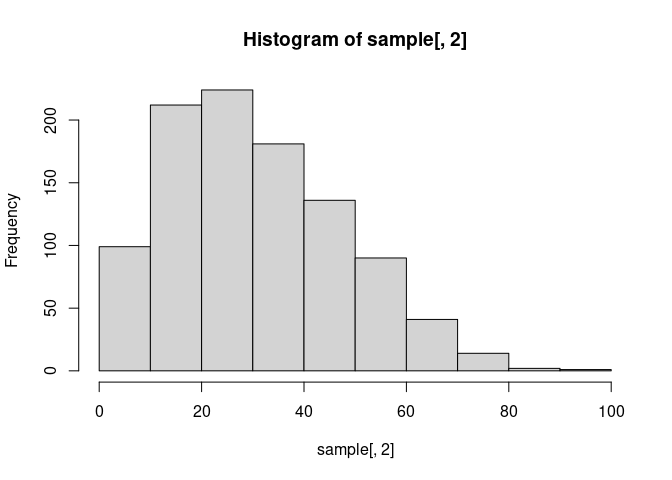
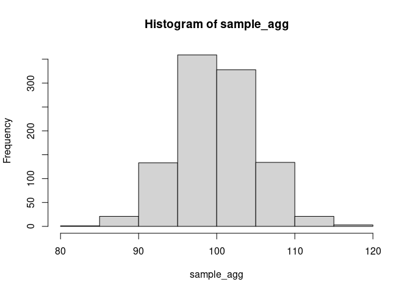

<!-- README.md is generated from README.Rmd. Please edit that file -->

## Installation

<!-- badges: start -->
<!-- badges: end -->

You can install the development version of MaxentDisaggregation from
[GitHub](https://github.com/) with:

``` r
# install.packages("devtools")
devtools::install_github("simschul/MaxentDisaggregation")
```

Note, this package is under constant development. Together with
co-authors, I’m currently preparing a journal article for describing
more of the background of data disaggregation and showing use cases
within the field of Industrial Ecology.

## Background: Uncertainty propagation involving data disaggregation

The goal of MaxentDisaggregation is an R-package that helps you with
uncertainty propagation when data disaggregation is involved. Data
disaggregation usually involves splitting one data point into several
disaggregates using proxy data. It is a common problem in many different
research disciplines.


Data disaggregation usually involves an aggregate flow $Y_0$, which is
known, such as the total amount of steel manufactured in a given time
and geography. What we do not know but are interested in are the $K$
disaggregate flows $Y_1,...,Y_K$, such as the different end-use sectors
where the manufactured steel ends up. Even though we do not know the
values of $Y_1, ..., Y_K$, our model structures commonly demands that
the individual $Y_i$’s need to sum to the known aggregate flow $Y_0$ to
respect the mass, energy, stoichiometric or economic balance of the
model

$$
  Y_0 = \sum_{i=1}^{K} Y_i 
$$

This equation, also called an *accounting identity* introduces
dependencies/correlations between the individual disaggregate flows
$Y_i$.

To get estimates for the disaggregate flows, one usually looks for proxy
data. Those proxy data are used to calculate shares (ratios/fractions)
of the respective disaggregate units $\alpha_1, ..., \alpha_K$. To
allocate the entire aggregate flow without leaving any residual (thus to
respect the system balance), those fractions need to sum to one:

$$    \sum_{i=1}^{K} \alpha_i = 1 $$

Disaggregate flows are calculated as

$$ y_i = \alpha_i y_0,  \forall i \in \{1,...,K\}.     $$

## Sampling disaggregates

This package generates a random sample of disaggregates based on the
information provided. The aggregate and the shares are sampled
independently. The distribution from which to sample is determined
internally based on the information provided by the user. This choice of
distribution is mostly based on the principle of Maximum Entropy
(MaxEnt).

The aggregate distribution is determined using the following decision
tree:

<!--  -->


The shares are sampled from different variants of the Dirichlet
distribution:

<!--  -->


## How to use

### Sampling disaggregates

The main function is `rdisagg` which creates a random sample of
disaggregates based on the information provided:

``` r
library(MaxentDisaggregation)
#> Loading required package: truncnorm
#> Loading required package: nloptr
#> Loading required package: gtools
#> Loading required package: data.table
#> 
#> Attaching package: 'MaxentDisaggregation'
#> The following object is masked from 'package:gtools':
#> 
#>     rdirichlet
sample <- rdisagg(n = 1000, mean_0 = 100, sd_0 = 5, min = 0, shares = c(0.1, 0.3, 0.6))
head(sample)
#>           [,1]      [,2]     [,3]
#> [1,]  5.437754  4.604358 92.92013
#> [2,]  1.341680 15.575565 79.45574
#> [3,] 21.962709 12.805128 61.45783
#> [4,] 10.731522 17.035623 75.34702
#> [5,]  1.069929 32.948392 59.33645
#> [6,] 18.825718 19.146667 54.46976
```

We can plot the marginal histograms of the sample:

``` r
hist(sample[,1])
```


``` r
hist(sample[,2])
```



``` r
hist(sample[,3])
```


The samples are consistent with all information provided. Thus, summing
the disaggregate samples should provide an aggregate sample consistent
with the information provided (mean: 100, sd: 5):

``` r
sample_agg <- rowSums(sample)
hist(sample_agg)
```


And indeed:

``` r
cat('Mean: ', mean(sample_agg), '\n')
#> Mean:  99.9587
cat('SD: ', sd(sample_agg))
#> SD:  4.888721
```

### Sampling aggregates and shares seperatedely

With `MaxentDisaggregation` you can also sample the aggregate and the
shares independently using the `ragg` and `rshares` functions:

``` r
sample_agg <- ragg(1000, mean = 100, sd = 5)
hist(sample_agg)
```



``` r
sample_shares <- rshares(1000, shares = c(0.1, 0.3, 0.6))
boxplot(sample_shares)
```


### Different scenarios of information available

TODO

``` r
rdisagg(n = 1000, mean_0 = 100, sd_0 = 5, min = 0, shares = c(0.1, 0.3, 0.6))
#>                 [,1]      [,2]       [,3]
#>    [1,] 2.301760e+00 25.642891  76.521310
#>    [2,] 5.485505e-01 31.256130  74.666213
#>    [3,] 1.541305e+01 11.180859  65.553984
#>    [4,] 6.541688e+00 24.408674  64.941481
#>    [5,] 2.283583e+00 30.754060  80.182682
#>    [6,] 5.069974e-04 56.004201  47.636953
#>    [7,] 7.311855e-01 73.074274  34.375289
#>    [8,] 2.943251e+00 54.450322  42.324774
#>    [9,] 1.201884e+00 35.956690  66.992026
#>   [10,] 4.256822e+01 33.790597  13.559660
#>   [11,] 2.359636e+01 17.529187  48.036979
#>   [12,] 1.300907e+01 23.746782  58.483679
#>   [13,] 1.930458e+00 17.308604  74.216986
#>   [14,] 1.459885e+01  8.803280  77.178411
#>   [15,] 7.134261e+00 34.052332  58.415803
#>   [16,] 2.392177e+01 32.776158  46.171853
#>   [17,] 4.928803e+00 29.304391  60.369406
#>   [18,] 2.505922e+01 44.542094  29.125593
#>   [19,] 1.942491e-02 20.918564  85.425980
#>   [20,] 1.154441e+01 22.860056  65.220172
#>   [21,] 1.548852e+00 32.968025  60.334504
#>   [22,] 1.062968e+01 19.610821  67.597563
#>   [23,] 3.190323e-01 15.474033  88.350809
#>   [24,] 1.235832e+01 12.964184  76.241506
#>   [25,] 6.171592e+00 31.669600  63.994410
#>   [26,] 1.744239e-02 13.523475  85.830078
#>   [27,] 3.994543e-02 33.978266  63.401716
#>   [28,] 1.855490e+01 46.389242  34.991496
#>   [29,] 3.467617e+00  2.707532 100.870076
#>   [30,] 5.620525e+00  9.598421  86.670131
#>   [31,] 1.117104e+01 30.490926  57.282087
#>   [32,] 3.342003e+01 19.876412  44.474433
#>   [33,] 1.901169e+01 27.662585  53.908721
#>   [34,] 3.589810e+00 11.258455  85.875419
#>   [35,] 1.309507e+01 33.062901  58.785511
#>   [36,] 6.097170e-02 53.219953  35.795694
#>   [37,] 1.208070e-01  9.588546  95.149970
#>   [38,] 5.669417e+00 29.716248  64.922715
#>   [39,] 1.200829e+00 58.149899  37.848540
#>   [40,] 3.771224e-01 28.749787  67.245826
#>   [41,] 4.707118e+01 13.209915  42.157879
#>   [42,] 1.231710e+01 29.735232  56.324462
#>   [43,] 2.461903e-01 30.791497  67.140899
#>   [44,] 1.487139e-02 29.880422  74.360228
#>   [45,] 2.047534e+01 44.691694  34.786633
#>   [46,] 4.956976e+00 34.416878  50.896632
#>   [47,] 1.873263e+00 42.821068  57.074146
#>   [48,] 5.008465e+00 22.804832  78.341021
#>   [49,] 4.410967e+01 29.590789  22.421336
#>   [50,] 4.282312e+00 26.679822  61.731469
#>   [51,] 1.014930e-01 31.103028  64.642233
#>   [52,] 1.465202e+01 17.159661  64.277713
#>   [53,] 9.712767e+00 62.755321  30.829244
#>   [54,] 7.711059e-01 65.723685  31.621318
#>   [55,] 1.422621e+01 27.474330  59.619542
#>   [56,] 1.344151e+00 24.817633  72.663444
#>   [57,] 3.119697e+00  4.942798  86.299465
#>   [58,] 1.746911e+00 26.057299  70.764666
#>   [59,] 2.670026e-02 17.446822  83.175842
#>   [60,] 1.850888e+00 24.588631  74.029475
#>   [61,] 3.254402e+00 20.592194  81.800975
#>   [62,] 2.238573e+01 16.865612  56.354852
#>   [63,] 5.823023e+00 38.925569  60.562358
#>   [64,] 3.504640e+00 42.308732  55.719362
#>   [65,] 1.203711e+01 40.808870  52.311007
#>   [66,] 2.246717e+00 27.763861  72.484379
#>   [67,] 1.130152e+01 11.391050  70.029261
#>   [68,] 1.325361e+01 32.963210  52.247732
#>   [69,] 1.504478e-02 38.122048  61.838004
#>   [70,] 1.197846e+00 45.420426  49.432080
#>   [71,] 5.910145e-01 76.355616  24.095056
#>   [72,] 2.230528e+01  7.855665  77.956634
#>   [73,] 1.005362e+00 24.780445  77.715290
#>   [74,] 2.934995e+00 12.683742  87.835377
#>   [75,] 2.364512e+01 29.927441  54.715114
#>   [76,] 2.144519e+01 28.907747  56.931487
#>   [77,] 1.283320e+01 39.208850  45.332970
#>   [78,] 8.837902e+00 25.609652  63.904206
#>   [79,] 6.491240e-02 90.854736  12.212887
#>   [80,] 1.365133e+01 34.891200  49.365694
#>   [81,] 2.421254e+01 12.421642  61.408336
#>   [82,] 1.867580e-01 21.738964  71.837772
#>   [83,] 1.166374e+01 35.117831  43.850592
#>   [84,] 4.314440e+00 11.581943  84.730650
#>   [85,] 2.952624e+00 10.662979  86.520575
#>   [86,] 1.049318e+01 33.304341  43.690717
#>   [87,] 9.668288e-01 13.329891  86.155853
#>   [88,] 1.251480e+01 36.963640  52.987099
#>   [89,] 3.007669e+00 29.324548  70.244064
#>   [90,] 1.104848e+01 33.730275  51.857161
#>   [91,] 1.227929e+01 13.270162  75.736028
#>   [92,] 1.952437e+01  5.775772  71.153964
#>   [93,] 7.866209e+00 35.449603  57.056364
#>   [94,] 2.112770e+00 68.731037  26.289797
#>   [95,] 5.052033e+01 27.002849  23.501376
#>   [96,] 1.031705e+00 28.229459  72.772927
#>   [97,] 1.164997e+00 17.040321  77.549807
#>   [98,] 1.540938e+01 48.457673  34.774809
#>   [99,] 4.259416e+00 23.954511  71.362545
#>  [100,] 7.115757e+00 60.380377  33.821740
#>  [101,] 1.349317e+01 19.168678  66.831356
#>  [102,] 4.883096e+00 56.382826  41.326469
#>  [103,] 1.631384e+00 10.777248  90.424738
#>  [104,] 1.519131e+01 21.329170  62.753294
#>  [105,] 9.093506e+00 59.716563  28.140518
#>  [106,] 1.825020e+01 31.370947  52.269007
#>  [107,] 2.733895e+00 77.181082  19.000847
#>  [108,] 5.805005e-01 31.086291  76.184915
#>  [109,] 3.691580e+01  6.745910  55.106671
#>  [110,] 2.882175e+00  7.589474  87.628999
#>  [111,] 2.174078e+00 52.490255  43.078520
#>  [112,] 5.097020e+00 58.515360  32.012360
#>  [113,] 8.326763e+00 30.480979  51.356685
#>  [114,] 4.849063e+01 24.525690  35.964973
#>  [115,] 1.396661e+01 17.625845  66.503370
#>  [116,] 1.041073e+01  4.007316  80.982800
#>  [117,] 6.982648e+00 49.950240  49.364827
#>  [118,] 9.887446e+00 26.756093  57.656773
#>  [119,] 4.452144e+00  5.239621  89.047386
#>  [120,] 4.574733e+00 50.228932  40.619721
#>  [121,] 5.912458e-01 26.716280  76.451991
#>  [122,] 4.306382e-01  6.686546  88.739190
#>  [123,] 1.875503e+00 17.434693  73.447982
#>  [124,] 5.864946e+00 16.698020  78.949313
#>  [125,] 7.445595e+00 36.375117  49.670369
#>  [126,] 9.586912e+00 34.374556  57.775291
#>  [127,] 2.468689e+00 30.807495  68.428779
#>  [128,] 1.140924e+01 12.021922  69.391002
#>  [129,] 2.886219e-01 19.070387  87.907408
#>  [130,] 2.513142e+01 16.767924  56.134720
#>  [131,] 3.242303e+00 12.524286  85.371146
#>  [132,] 7.116864e+00 12.857019  71.227656
#>  [133,] 6.675552e+00 10.624183  87.170176
#>  [134,] 5.614816e-02 31.163560  64.259613
#>  [135,] 1.929472e+00 30.590915  60.272979
#>  [136,] 1.021655e+01 44.842023  52.856113
#>  [137,] 9.783801e-02 56.897341  39.904838
#>  [138,] 6.210640e+00 47.273404  59.677649
#>  [139,] 4.028579e+00 22.303858  72.441126
#>  [140,] 4.660203e-03 26.288269  73.312074
#>  [141,] 4.057275e+01 28.154619  30.729694
#>  [142,] 2.344940e+01 42.029062  41.377637
#>  [143,] 7.164839e+00 37.734262  50.195043
#>  [144,] 6.743556e-02 60.867953  35.163394
#>  [145,] 1.394159e+01 33.458402  52.156871
#>  [146,] 2.169885e+01  7.317155  63.633773
#>  [147,] 1.270423e+01 25.717879  65.399792
#>  [148,] 2.644799e+01  8.794699  72.585336
#>  [149,] 5.781202e+00 14.337269  82.910835
#>  [150,] 4.464534e-01 44.681262  56.885406
#>  [151,] 6.964413e+00 12.615855  72.981295
#>  [152,] 5.632055e+00 44.648644  46.363731
#>  [153,] 1.270968e+01 36.897449  49.198283
#>  [154,] 3.316828e-01 15.669095  85.405342
#>  [155,] 9.809857e+00 55.158480  34.444331
#>  [156,] 9.960829e-01 10.822262  82.347217
#>  [157,] 1.822007e+01 47.040016  40.205772
#>  [158,] 7.907894e+00 53.801021  33.357891
#>  [159,] 1.207029e+00  9.849879  81.384244
#>  [160,] 5.878053e+00 35.753029  52.953613
#>  [161,] 3.970393e+00 11.999422  94.315181
#>  [162,] 1.266712e+00 18.401632  87.054386
#>  [163,] 1.115016e+01 21.101917  73.217267
#>  [164,] 2.744666e+01 23.286261  45.765955
#>  [165,] 8.472540e+00 11.551823  77.662532
#>  [166,] 1.920546e-01  2.890551  94.085592
#>  [167,] 4.708785e+00 12.851874  90.145085
#>  [168,] 2.873946e+00 16.086009  87.185837
#>  [169,] 1.516130e+01 19.131033  65.881270
#>  [170,] 7.180739e+00 21.364926  71.312048
#>  [171,] 2.698853e-01 36.007178  60.202599
#>  [172,] 3.089042e+00 36.860805  47.804475
#>  [173,] 7.237735e+00 14.663756  85.072962
#>  [174,] 5.392627e+00 44.611259  46.229093
#>  [175,] 3.181475e-02 68.158814  31.121429
#>  [176,] 8.367576e-01 28.804869  67.570599
#>  [177,] 5.568028e+00 19.341101  81.697963
#>  [178,] 3.490870e+01 26.351839  40.980247
#>  [179,] 3.670184e-01 27.552955  71.016252
#>  [180,] 1.717499e+01 34.128311  48.500494
#>  [181,] 5.655216e+00 35.530213  61.836634
#>  [182,] 3.151874e+01 56.582970  10.897623
#>  [183,] 2.568511e+00 22.779174  65.186635
#>  [184,] 1.404582e+01 55.439048  32.323197
#>  [185,] 4.835285e+00 32.421238  59.104689
#>  [186,] 1.786299e+01 28.164869  52.695258
#>  [187,] 7.714345e+00 53.321762  41.269469
#>  [188,] 4.082447e-01 28.540711  65.479578
#>  [189,] 2.015220e+00 17.496219  82.875443
#>  [190,] 1.447595e+01 55.118074  32.252448
#>  [191,] 2.689861e+01 31.904441  33.723370
#>  [192,] 3.265511e+01 27.823955  37.036106
#>  [193,] 1.603431e+01 39.233079  45.471087
#>  [194,] 6.370150e+00 64.483828  26.010833
#>  [195,] 5.062094e+01 21.645463  30.979486
#>  [196,] 4.737813e+00 19.877272  76.357536
#>  [197,] 1.594999e+01  5.669101  76.616103
#>  [198,] 3.624475e-01 33.510841  73.327399
#>  [199,] 4.811143e+01 30.741978  24.854553
#>  [200,] 2.527477e+01  8.436567  71.281807
#>  [201,] 1.201449e+01 18.376563  65.250942
#>  [202,] 4.373956e-02 30.200398  72.573967
#>  [203,] 1.965489e+00 42.950043  49.291832
#>  [204,] 1.420712e+00 54.863924  48.767926
#>  [205,] 1.906391e+01 35.329633  40.859197
#>  [206,] 1.869128e-03  2.968673  92.250448
#>  [207,] 6.692100e+00 33.171153  63.095349
#>  [208,] 4.790955e+00 25.036422  65.044085
#>  [209,] 2.290298e-01 54.701279  41.790935
#>  [210,] 3.300838e+01 33.639311  31.429842
#>  [211,] 3.164923e+00 20.264606  75.306455
#>  [212,] 1.314634e+01 62.455052  35.703976
#>  [213,] 1.603503e+01 13.855705  81.488309
#>  [214,] 2.742231e+01 40.303219  29.957434
#>  [215,] 6.725414e+00 21.536110  81.735748
#>  [216,] 3.505781e+01 11.558903  60.741098
#>  [217,] 4.095074e+00 48.984771  47.704077
#>  [218,] 3.623971e+00 18.061365  80.687448
#>  [219,] 1.148244e+01  7.978968  79.319475
#>  [220,] 4.705909e+00 11.935202  89.270156
#>  [221,] 1.165900e+01 13.681393  76.653189
#>  [222,] 9.207887e+00 17.726179  75.073021
#>  [223,] 1.002229e+01  7.250830  82.527475
#>  [224,] 5.842475e+00 46.640746  48.955457
#>  [225,] 1.051601e+00 34.600765  61.650441
#>  [226,] 3.348528e+00 31.207460  61.119630
#>  [227,] 4.832935e+00 70.535523   8.049534
#>  [228,] 2.367269e+01 23.112475  42.714430
#>  [229,] 8.141268e+00 61.503220  27.737823
#>  [230,] 4.792719e+00 19.184289  79.291938
#>  [231,] 2.212766e+00 25.896394  65.420249
#>  [232,] 9.393597e-02 19.274973  82.049051
#>  [233,] 8.834135e+00 23.117475  67.443767
#>  [234,] 6.502996e-01 27.011284  70.206322
#>  [235,] 8.883782e+00 41.829484  51.335828
#>  [236,] 2.186861e-02 19.844624  83.652120
#>  [237,] 3.323102e+01 23.312298  50.164075
#>  [238,] 4.607664e+00  9.620705  76.165914
#>  [239,] 2.626751e+01 29.690583  50.566387
#>  [240,] 5.498416e+00 48.328795  57.993849
#>  [241,] 5.265413e+00 21.417386  79.001361
#>  [242,] 1.115839e+01 21.346717  70.279459
#>  [243,] 4.784918e+00 61.626895  36.676937
#>  [244,] 8.725000e+00 32.400827  61.525566
#>  [245,] 2.132628e+01 39.580197  34.282846
#>  [246,] 1.233139e+00 50.186231  42.935093
#>  [247,] 1.081103e+01 57.096202  34.495041
#>  [248,] 1.067682e+01 34.260202  57.545253
#>  [249,] 2.298901e+00 14.622256  85.830159
#>  [250,] 5.171567e+00 31.951241  66.408315
#>  [251,] 4.878585e+00 39.411428  51.157907
#>  [252,] 1.834546e+00 35.135986  51.737062
#>  [253,] 3.232143e+01  2.865691  58.507846
#>  [254,] 1.319842e+01 28.340866  71.999318
#>  [255,] 1.376511e+01 16.553422  71.169933
#>  [256,] 5.613191e+01 34.088157   7.944781
#>  [257,] 1.490159e+01 48.802322  36.908008
#>  [258,] 5.317112e+00 12.939514  84.576565
#>  [259,] 2.052303e+00 59.188121  40.556499
#>  [260,] 8.950630e+00 25.485086  63.115642
#>  [261,] 1.208310e+01  8.991309  82.646856
#>  [262,] 7.951096e+00 15.337185  76.589541
#>  [263,] 2.535305e+00 25.574379  76.894655
#>  [264,] 9.754235e+00  2.477405  91.451963
#>  [265,] 1.097417e+00 12.569790  91.723720
#>  [266,] 1.214545e+01  6.915170  71.656994
#>  [267,] 2.531865e+01 37.773790  40.371924
#>  [268,] 9.504054e+00 13.385243  75.334383
#>  [269,] 3.027921e+01 30.050432  42.295184
#>  [270,] 3.582879e+00 33.358321  62.806698
#>  [271,] 3.549069e+01 45.644857  18.552790
#>  [272,] 2.761393e+01 16.404557  49.338636
#>  [273,] 3.579425e-01 17.902471  85.489574
#>  [274,] 1.315023e+01 25.288732  55.518961
#>  [275,] 2.011113e+01 35.502376  46.360366
#>  [276,] 6.643388e-02 32.451524  69.543060
#>  [277,] 1.518446e+00 10.656116  90.850256
#>  [278,] 3.615115e+00 37.010363  58.006915
#>  [279,] 3.038510e+00 12.384094  87.030333
#>  [280,] 3.028629e+01 39.778827  23.824643
#>  [281,] 4.509853e+00 49.242230  47.889546
#>  [282,] 1.537850e+00 71.438107  27.431712
#>  [283,] 4.625305e+01 10.890285  44.872152
#>  [284,] 1.952255e+00  5.444734  99.973735
#>  [285,] 2.527053e+01 19.812171  43.843086
#>  [286,] 9.833946e+00 30.207677  59.231440
#>  [287,] 1.315396e+00 38.598056  61.179723
#>  [288,] 2.782626e-01 50.068589  52.568244
#>  [289,] 1.174529e+01 42.636588  45.409014
#>  [290,] 3.734111e+01 27.536538  41.078629
#>  [291,] 1.367967e+01 12.172234  73.013844
#>  [292,] 6.665229e+00 37.236041  54.312813
#>  [293,] 6.016143e+01  8.428216  29.862941
#>  [294,] 9.278126e+00 21.898608  67.055530
#>  [295,] 8.993637e+00 29.359313  67.107369
#>  [296,] 1.068401e+00 42.175242  54.301946
#>  [297,] 2.803425e+00 52.515067  33.950521
#>  [298,] 1.494241e+01  7.957902  74.265087
#>  [299,] 8.635567e+00 21.531574  70.746556
#>  [300,] 1.116774e+01 21.714955  60.920622
#>  [301,] 5.776219e+00 34.728095  57.211699
#>  [302,] 2.626737e+01 47.764672  29.368824
#>  [303,] 8.064655e+00  4.346272  82.004463
#>  [304,] 8.556365e-01 52.688946  56.208383
#>  [305,] 1.547179e+01 29.863899  57.618395
#>  [306,] 5.052899e-01 32.011972  69.697561
#>  [307,] 9.858992e+00 21.564592  73.010000
#>  [308,] 1.304806e+01 32.156383  50.610916
#>  [309,] 3.758790e+00 38.108834  46.634653
#>  [310,] 2.140901e+01 26.924614  44.295381
#>  [311,] 3.709367e+00 16.632119  79.216986
#>  [312,] 3.665588e+00 27.584232  66.839666
#>  [313,] 2.818688e+00 45.419222  53.411393
#>  [314,] 8.659266e+00 39.699905  55.368442
#>  [315,] 5.376792e-02 60.847492  40.476264
#>  [316,] 1.277026e+00  7.908201  90.582670
#>  [317,] 2.700505e+01 32.315635  43.799218
#>  [318,] 2.360655e+00 14.767152  86.469419
#>  [319,] 1.809536e+01 19.828615  62.343612
#>  [320,] 1.813893e+00 60.773895  39.335548
#>  [321,] 2.903540e+00 54.866673  39.891048
#>  [322,] 6.058972e+00 21.464846  69.658688
#>  [323,] 2.533961e+00 56.094531  46.271743
#>  [324,] 5.540890e+00 57.197470  38.398214
#>  [325,] 1.357325e+00 21.297749  73.927683
#>  [326,] 4.837382e+00 27.731434  67.988634
#>  [327,] 1.787764e+00 53.022354  46.898904
#>  [328,] 6.317163e+00 58.035868  25.828896
#>  [329,] 1.595840e+01  7.048152  68.511272
#>  [330,] 1.784478e+01 10.346112  74.152454
#>  [331,] 1.447506e+00 72.452291  23.944247
#>  [332,] 2.426331e+01 34.267217  47.057995
#>  [333,] 1.119017e+01  8.186443  83.915917
#>  [334,] 3.130590e+00 69.759942  32.010280
#>  [335,] 2.866909e+00 31.704454  60.592331
#>  [336,] 2.966916e+00 28.400085  68.492316
#>  [337,] 1.201413e+01 57.246879  34.911356
#>  [338,] 1.321889e+01 32.425990  49.851953
#>  [339,] 6.455656e+00 30.799169  63.343524
#>  [340,] 1.499051e+01 20.413720  66.321059
#>  [341,] 5.327944e+00 22.525009  65.112097
#>  [342,] 2.413491e+01 26.370519  51.131982
#>  [343,] 1.716010e+01 31.551737  59.103606
#>  [344,] 2.464712e+00  7.140673  87.614386
#>  [345,] 2.369237e+01 30.340904  45.451603
#>  [346,] 3.300168e+00 17.688539  76.697984
#>  [347,] 1.663816e+00 14.014636  89.063064
#>  [348,] 1.603985e+01 35.127530  54.777976
#>  [349,] 1.543002e+01 24.797709  62.514201
#>  [350,] 5.400772e+00 17.751934  83.847371
#>  [351,] 1.086787e+01  4.990028  83.641035
#>  [352,] 8.596496e-01 24.512370  71.915213
#>  [353,] 3.009496e+00 35.523056  68.516325
#>  [354,] 1.182093e+01 69.510094  20.496500
#>  [355,] 1.401613e+00 29.923647  70.933912
#>  [356,] 8.496047e+00 54.522326  40.764860
#>  [357,] 3.617940e+00 56.262812  39.547691
#>  [358,] 3.402120e-01 41.274853  51.385383
#>  [359,] 1.251413e+01 17.827212  69.061496
#>  [360,] 1.225157e+01 48.401027  49.944452
#>  [361,] 4.135155e+01 24.362925  34.350290
#>  [362,] 1.560974e+00 52.747116  53.351640
#>  [363,] 5.070363e-01 32.356918  71.534815
#>  [364,] 2.653473e+00 51.537170  51.672755
#>  [365,] 9.200963e-01 29.814861  67.738683
#>  [366,] 6.550000e-01 24.192295  72.334783
#>  [367,] 2.054951e+00 29.612157  74.320598
#>  [368,] 3.178843e+00 35.273316  68.611053
#>  [369,] 2.395945e+01 39.538214  30.125964
#>  [370,] 1.601066e+01 12.688172  73.347039
#>  [371,] 2.252861e-01 20.349823  74.056795
#>  [372,] 1.124958e+01 24.893112  71.206980
#>  [373,] 7.193546e+00  8.802381  89.376247
#>  [374,] 7.944247e+00 35.137338  55.668270
#>  [375,] 7.181679e+00  3.951352  93.341121
#>  [376,] 2.918795e+00  7.963817  89.877583
#>  [377,] 2.753021e+01 35.728837  27.960756
#>  [378,] 5.989986e-01 31.231584  66.790000
#>  [379,] 1.306572e+01 25.550186  59.426333
#>  [380,] 2.905674e+01 37.853660  39.800300
#>  [381,] 2.212933e+01 45.605273  26.515607
#>  [382,] 5.792459e-01 41.838887  59.571045
#>  [383,] 2.488366e+00 40.641595  58.558310
#>  [384,] 1.047192e+01  9.377550  71.697277
#>  [385,] 4.009759e+00 12.236688  79.759355
#>  [386,] 2.093992e+01 14.470288  60.016102
#>  [387,] 1.056599e+01 17.589034  76.936969
#>  [388,] 1.829809e+01 30.171660  53.423261
#>  [389,] 6.863099e+00 28.226699  67.484110
#>  [390,] 1.529094e+01 10.972834  65.692470
#>  [391,] 1.071794e+01 63.504966  26.447193
#>  [392,] 7.293720e+00 44.164322  50.244252
#>  [393,] 9.042477e+00  7.558407  84.189220
#>  [394,] 1.331500e+01 45.685274  39.316954
#>  [395,] 3.795569e+01 54.338571  15.961150
#>  [396,] 1.879260e+01 27.957173  51.746913
#>  [397,] 1.952261e+00  8.724691  92.271493
#>  [398,] 2.107905e+01 14.971702  58.891487
#>  [399,] 4.889782e-01 30.357387  67.140538
#>  [400,] 8.920591e-01 15.770130  82.734295
#>  [401,] 2.651398e+00 86.749151  22.510241
#>  [402,] 3.855607e+00 49.310111  44.016786
#>  [403,] 1.520404e+01 21.215429  65.475449
#>  [404,] 1.512402e+01 37.245742  48.072804
#>  [405,] 2.287675e+00 38.762481  59.657912
#>  [406,] 2.609380e+01 34.834832  38.948765
#>  [407,] 7.237617e+00 53.554550  43.470194
#>  [408,] 8.371550e-01 37.926721  67.352518
#>  [409,] 2.284512e-01 34.258383  67.712037
#>  [410,] 3.794825e-01 31.758407  69.695812
#>  [411,] 2.192014e+00 23.465965  68.597286
#>  [412,] 1.575568e+01 24.139432  66.142256
#>  [413,] 1.146531e+01 11.390493  85.253579
#>  [414,] 3.043078e+00 18.984571  73.500736
#>  [415,] 5.596408e-01  3.560996  98.573605
#>  [416,] 5.646275e+00 39.664165  52.934037
#>  [417,] 9.150599e+00  3.218487  86.954070
#>  [418,] 7.996465e+00 21.278649  70.478175
#>  [419,] 1.191344e+01 11.427279  75.954119
#>  [420,] 1.282311e-01 16.573793  86.056141
#>  [421,] 1.151698e+00 44.679671  54.750689
#>  [422,] 8.380441e+00 19.630953  61.710087
#>  [423,] 1.934233e+01 26.286926  51.059268
#>  [424,] 2.353830e+01 41.488958  30.816365
#>  [425,] 3.915586e-01 30.921163  69.114824
#>  [426,] 1.237638e+01 25.562265  56.951341
#>  [427,] 9.244808e-02 29.084375  68.048100
#>  [428,] 1.719959e+01 20.261527  59.456599
#>  [429,] 2.370141e+01 12.637392  69.376000
#>  [430,] 8.116316e+00 30.591976  62.843380
#>  [431,] 3.966346e+00 14.707687  82.315560
#>  [432,] 1.198568e+01 19.910701  70.468843
#>  [433,] 6.773878e-01 11.835727  86.136393
#>  [434,] 1.568258e+01 28.051991  60.167776
#>  [435,] 2.092286e-01 35.895736  62.861759
#>  [436,] 1.504021e+00 39.376465  55.941455
#>  [437,] 4.093782e+00 31.566388  63.394840
#>  [438,] 2.368524e+00 13.922878  88.416512
#>  [439,] 3.352956e-01 47.404445  53.439633
#>  [440,] 1.385642e+01 18.330763  66.520921
#>  [441,] 1.940923e-01 40.058125  63.764665
#>  [442,] 3.970815e+00 56.741314  49.608938
#>  [443,] 2.163388e+01 38.438282  39.408264
#>  [444,] 2.307427e+00 66.021207  33.251973
#>  [445,] 9.622180e-01 33.720270  68.262800
#>  [446,] 7.812279e+00 21.705759  67.220994
#>  [447,] 5.191396e+00 30.215509  66.462824
#>  [448,] 2.252428e+01 40.466347  30.940444
#>  [449,] 1.833452e+00 49.697510  46.753208
#>  [450,] 8.711651e-01 15.279485  85.963906
#>  [451,] 1.715597e+00 51.770549  49.518382
#>  [452,] 2.424161e+00 38.871718  64.328571
#>  [453,] 3.118938e+01  2.539337  66.218892
#>  [454,] 3.251435e+01 10.331865  52.344790
#>  [455,] 1.359974e-01 26.935795  67.813051
#>  [456,] 1.916751e+00 40.823007  60.796493
#>  [457,] 1.724367e+00 27.512571  69.426045
#>  [458,] 1.136133e-01 20.921696  72.450799
#>  [459,] 1.057820e+01 38.562108  48.404638
#>  [460,] 1.653899e+01 36.897629  43.743384
#>  [461,] 2.299807e+00 26.223077  63.256472
#>  [462,] 7.951296e-01 70.293941  29.347018
#>  [463,] 1.974889e+01 12.786116  65.495756
#>  [464,] 1.015975e+00 48.298034  55.408961
#>  [465,] 6.059865e+00  7.171003  82.375097
#>  [466,] 1.945099e+00 20.992615  78.088964
#>  [467,] 3.787236e+00 26.253010  80.395728
#>  [468,] 1.082391e+01 10.674579  70.786890
#>  [469,] 4.662721e-01 38.637915  58.919363
#>  [470,] 2.177699e+01 16.050078  60.167941
#>  [471,] 1.020036e+01 11.166626  79.715369
#>  [472,] 1.638222e+01 14.839240  68.912367
#>  [473,] 8.583749e+00 11.601364  70.504470
#>  [474,] 1.049067e+00 18.810580  78.782857
#>  [475,] 1.682426e+01 22.707237  56.355537
#>  [476,] 3.283465e+01 34.334870  36.659953
#>  [477,] 1.674331e+01 40.335030  42.010467
#>  [478,] 4.630582e-02 20.809332  73.926487
#>  [479,] 8.582969e+00  1.834630  86.525914
#>  [480,] 3.344438e+00 48.814370  48.928132
#>  [481,] 5.926798e-03 43.356539  57.867547
#>  [482,] 8.889088e+00 65.241398  27.074370
#>  [483,] 1.766559e+01  1.543283  79.135792
#>  [484,] 1.246762e+01 47.628960  42.270095
#>  [485,] 5.950730e+00 29.473896  63.446965
#>  [486,] 9.786318e-01 64.292111  42.683094
#>  [487,] 4.809641e+00 23.632875  71.141644
#>  [488,] 6.438185e-01 33.278121  63.697182
#>  [489,] 1.110152e+01 30.923715  50.090907
#>  [490,] 1.436481e+01 32.397420  52.665521
#>  [491,] 9.766766e-01 18.972528  89.870011
#>  [492,] 2.453512e+00 33.143235  61.704405
#>  [493,] 5.762071e+00 23.956006  66.591135
#>  [494,] 1.150550e+01 42.079809  45.938118
#>  [495,] 1.391544e+00 42.800092  56.131530
#>  [496,] 3.533936e-01 21.131570  69.478256
#>  [497,] 4.267214e+01 18.990190  40.501018
#>  [498,] 3.142490e+00 10.829351  88.536269
#>  [499,] 2.602649e-02 28.552621  64.963779
#>  [500,] 1.557532e+00 47.367367  50.554719
#>  [501,] 5.576093e-01 38.932749  61.877463
#>  [502,] 4.226655e+00 14.013156  74.182582
#>  [503,] 2.230650e+01 20.209853  57.881227
#>  [504,] 1.004148e+01 18.758427  61.981558
#>  [505,] 6.431186e+00 77.579351  25.716157
#>  [506,] 3.847892e-01 44.355223  64.878429
#>  [507,] 2.411370e+00 59.985925  35.429580
#>  [508,] 3.625488e+01  8.942243  53.066473
#>  [509,] 3.139340e+00 46.213909  37.032959
#>  [510,] 1.262049e+00 35.120083  72.920482
#>  [511,] 1.709898e-01 19.564162  81.311981
#>  [512,] 1.104743e+01  9.629409  74.877749
#>  [513,] 1.580581e+01 26.413488  56.984835
#>  [514,] 9.738733e+00 33.346843  53.678840
#>  [515,] 4.374577e+00 35.228853  63.149192
#>  [516,] 4.352500e+01 28.457195  37.314340
#>  [517,] 5.305135e+00 14.574053  68.451084
#>  [518,] 7.321647e-01 32.334964  59.722827
#>  [519,] 2.244925e-01 63.915713  36.138947
#>  [520,] 1.346630e+01 10.852868  68.296835
#>  [521,] 1.316847e-02 23.172650  77.930413
#>  [522,] 1.653714e-02 13.934282  91.138156
#>  [523,] 3.647099e-02 25.209318  68.845009
#>  [524,] 5.685697e+00 23.034348  69.716477
#>  [525,] 6.026492e+00 35.830908  62.664529
#>  [526,] 1.310380e+01 18.953079  73.604094
#>  [527,] 8.777608e+00 60.554624  35.918654
#>  [528,] 6.598584e+00 72.210003  22.715695
#>  [529,] 1.701835e+01 14.194833  71.400951
#>  [530,] 6.477263e+00 21.063549  69.401759
#>  [531,] 1.311073e+01 18.695229  73.259037
#>  [532,] 1.912873e-01 44.531332  62.598323
#>  [533,] 9.926339e+00 10.582035  81.839854
#>  [534,] 2.613867e+00 41.200556  51.494331
#>  [535,] 2.647226e+01  2.631313  72.885295
#>  [536,] 3.148884e+00 24.778815  79.475053
#>  [537,] 6.439116e+00 12.309152  79.798264
#>  [538,] 1.945945e+00 26.535455  77.000441
#>  [539,] 1.730896e+01 15.321739  67.167834
#>  [540,] 2.056492e+01 27.769277  54.557695
#>  [541,] 2.457315e+00 25.279378  77.133945
#>  [542,] 1.248917e+00 57.251059  36.016296
#>  [543,] 1.507727e+00 27.718654  70.429643
#>  [544,] 7.234374e+00 51.705927  31.614386
#>  [545,] 8.818068e+00 38.997630  46.937628
#>  [546,] 4.885852e-01 15.243808  83.271475
#>  [547,] 2.239281e+01 44.830324  30.243039
#>  [548,] 2.435098e+00 19.401563  74.175646
#>  [549,] 7.057707e+00 22.208317  71.381259
#>  [550,] 2.215983e+01 25.864362  47.277257
#>  [551,] 1.507061e+01 31.903682  49.040699
#>  [552,] 1.600528e+00 21.418492  72.739334
#>  [553,] 1.050953e+01 31.349728  56.902105
#>  [554,] 1.833061e-02 15.518389  86.412160
#>  [555,] 3.640954e+01 20.495723  50.142679
#>  [556,] 5.381692e+00 49.640114  42.458841
#>  [557,] 4.203584e+00 38.175226  56.504608
#>  [558,] 8.975104e+00 58.130126  32.051322
#>  [559,] 2.090935e+01 20.361921  60.740499
#>  [560,] 8.028559e+00 22.772173  70.282008
#>  [561,] 2.379567e-05  5.812179  90.621978
#>  [562,] 2.436884e+00 16.066869  87.415070
#>  [563,] 1.205401e+01  9.787551  75.740634
#>  [564,] 6.494698e+00 56.920667  36.891502
#>  [565,] 4.412454e+00  9.238793  91.414943
#>  [566,] 6.096836e+00 11.711319  84.893589
#>  [567,] 5.217206e+00 11.785273  80.276837
#>  [568,] 1.956347e+01 16.088907  67.928236
#>  [569,] 6.500682e+00 15.566745  81.920807
#>  [570,] 4.450680e-01 15.882834  81.385748
#>  [571,] 4.188068e+00 20.023814  80.506274
#>  [572,] 1.428895e+00 24.018241  68.763621
#>  [573,] 1.759148e+01  7.799255  82.682414
#>  [574,] 8.652136e+00 52.556162  46.820755
#>  [575,] 1.299456e+01 51.107165  38.319836
#>  [576,] 2.347050e+01 22.725028  52.138095
#>  [577,] 6.745890e-01 54.150189  37.920170
#>  [578,] 4.631472e-01 16.472850  78.813531
#>  [579,] 1.153881e+01 33.497231  62.491301
#>  [580,] 2.526082e-02 15.753337  79.633008
#>  [581,] 1.904287e+00 15.507746  90.762676
#>  [582,] 1.811971e-02 30.650263  67.819193
#>  [583,] 4.626259e+00 20.251201  80.350811
#>  [584,] 2.256944e+01 14.621537  60.185913
#>  [585,] 7.355784e-01 19.434626  83.867210
#>  [586,] 3.257399e+00 45.905357  42.912997
#>  [587,] 1.696998e+01 11.407324  70.357646
#>  [588,] 2.753468e+00 19.499286  71.881196
#>  [589,] 1.075874e+01 60.579522  30.524575
#>  [590,] 9.640507e+00 47.735449  45.236172
#>  [591,] 2.587006e+00 18.502420  80.928082
#>  [592,] 1.698353e+00 17.560850  73.631233
#>  [593,] 6.368332e-01 46.148560  53.331356
#>  [594,] 3.220475e+01  6.842185  64.979642
#>  [595,] 2.096676e+01 10.934061  61.541711
#>  [596,] 1.511951e+01 28.725012  57.890003
#>  [597,] 1.976553e+01 22.739877  60.215763
#>  [598,] 2.824774e+00 68.941462  24.375289
#>  [599,] 2.662858e+01 58.614755  13.775055
#>  [600,] 7.420723e+00 39.679049  47.234369
#>  [601,] 2.325853e+00 11.282756  88.443116
#>  [602,] 7.943541e+00 18.715935  72.412548
#>  [603,] 5.542704e+00 29.994953  77.153593
#>  [604,] 1.550274e+01 42.468156  44.029732
#>  [605,] 3.641965e+01 29.717216  38.741723
#>  [606,] 4.878070e+00 45.389354  47.096614
#>  [607,] 1.892977e+01 15.132106  59.866284
#>  [608,] 7.850314e+00 23.237540  75.474480
#>  [609,] 1.510557e+01 23.213760  54.002050
#>  [610,] 1.567016e+01 14.588726  69.303023
#>  [611,] 1.547240e+00 14.437409  82.632295
#>  [612,] 3.252754e+01 18.689120  54.654868
#>  [613,] 8.280824e+00 37.393274  40.627850
#>  [614,] 1.434228e+01 13.544529  76.503746
#>  [615,] 1.030038e+01 13.330230  84.289195
#>  [616,] 7.307208e-01 13.536422  82.155362
#>  [617,] 1.434293e+01 54.341819  29.140354
#>  [618,] 1.636188e+01  4.543037  71.422644
#>  [619,] 6.896030e+00 10.945235  92.275098
#>  [620,] 9.823186e+00 21.293050  64.115949
#>  [621,] 1.329632e+00  7.034949 100.798169
#>  [622,] 3.424027e+00 53.592589  48.088290
#>  [623,] 1.007668e+01  7.239011  83.274139
#>  [624,] 5.553616e+00 23.279636  63.702106
#>  [625,] 1.895921e+01 23.205266  52.796795
#>  [626,] 3.926697e+01  1.080360  59.323891
#>  [627,] 4.347219e+00 11.174282  93.067536
#>  [628,] 4.920487e+00  8.739225  92.570308
#>  [629,] 1.958159e+00 40.298220  53.910081
#>  [630,] 3.531261e+01 13.360147  48.703311
#>  [631,] 3.538030e-02 18.973141  84.561846
#>  [632,] 4.709099e+01 15.839136  42.360924
#>  [633,] 6.273120e+00 19.147729  79.248965
#>  [634,] 1.643315e+01 51.875867  30.405661
#>  [635,] 7.462262e-01 28.429061  72.827112
#>  [636,] 6.398018e+00 56.138805  33.520046
#>  [637,] 1.137588e+01 50.883649  34.156341
#>  [638,] 9.128285e+00 41.998338  52.851743
#>  [639,] 3.314943e+00 16.627758  71.576441
#>  [640,] 3.977759e+00 37.002375  46.424539
#>  [641,] 1.141086e+01 30.836037  59.312824
#>  [642,] 2.570869e+00 32.766345  70.306877
#>  [643,] 1.136099e+01 29.242242  64.293872
#>  [644,] 3.163674e+00 30.825303  65.404168
#>  [645,] 2.283011e-01 49.375963  42.620336
#>  [646,] 2.306460e-01 63.038422  49.797767
#>  [647,] 9.084842e+00 20.586945  70.003972
#>  [648,] 2.636732e-01 29.818973  65.931655
#>  [649,] 4.462824e+00 49.773458  50.246785
#>  [650,] 1.227290e+01 40.613324  43.204383
#>  [651,] 5.599131e+00 43.613051  52.142809
#>  [652,] 7.068181e-01 23.231978  75.720269
#>  [653,] 5.504916e+00 25.697761  68.820373
#>  [654,] 2.456869e+01  6.274638  71.177263
#>  [655,] 7.616054e-04 55.099764  49.996012
#>  [656,] 6.357296e+00 10.170289  74.690956
#>  [657,] 3.470675e+01 22.172954  41.923810
#>  [658,] 4.491196e+00 16.250660  76.075058
#>  [659,] 9.551272e-02 29.495758  75.251163
#>  [660,] 1.949900e+01 28.947909  46.634290
#>  [661,] 3.223188e+01 30.211777  29.552289
#>  [662,] 1.829850e+01 22.705171  54.471147
#>  [663,] 4.891210e+00  3.150613  86.157129
#>  [664,] 8.115832e-01 57.066511  41.264983
#>  [665,] 1.021434e+00 50.660790  40.804121
#>  [666,] 5.667566e-01 37.016617  61.215505
#>  [667,] 5.244770e-01 60.044288  40.080094
#>  [668,] 3.376188e+00 51.953664  48.967168
#>  [669,] 1.181822e+00 51.814514  45.471538
#>  [670,] 2.626122e+01 14.408847  60.106705
#>  [671,] 1.553482e+00  5.778260  95.962836
#>  [672,] 8.067611e+00 12.067567  82.131612
#>  [673,] 4.439511e-01 74.069064  32.633262
#>  [674,] 8.987586e+00 33.665945  54.268288
#>  [675,] 1.635907e+01 18.899684  59.935103
#>  [676,] 2.849358e+00 12.732065  72.785303
#>  [677,] 4.862006e+00 17.448594  78.142742
#>  [678,] 3.130848e+01 43.393357  30.556020
#>  [679,] 7.819496e+00  6.658650  80.226235
#>  [680,] 3.088322e+01 24.145216  44.951814
#>  [681,] 3.450536e+01 22.346569  36.838707
#>  [682,] 1.865661e+01 15.468779  62.979988
#>  [683,] 9.026115e+00 45.116950  48.778474
#>  [684,] 2.316679e+00 30.359057  56.364523
#>  [685,] 1.449027e-01 38.953830  61.563103
#>  [686,] 3.133798e+01  1.936384  69.335070
#>  [687,] 1.357409e+01 45.487552  36.523105
#>  [688,] 2.794843e+01 18.892385  46.697062
#>  [689,] 3.212463e+00 44.280802  50.270430
#>  [690,] 7.093856e+00 18.897303  65.185110
#>  [691,] 3.652139e+00  6.199751  93.747497
#>  [692,] 4.243433e+01 14.014570  41.890511
#>  [693,] 2.550591e+01 47.141840  24.460241
#>  [694,] 2.033396e+00 15.338354  74.734448
#>  [695,] 6.367184e-01 56.023281  44.206065
#>  [696,] 1.226523e+01 26.382152  63.377441
#>  [697,] 1.281047e+01 21.782783  62.011141
#>  [698,] 1.319297e+00 13.330009  76.486925
#>  [699,] 3.964350e+00  4.508533  89.868379
#>  [700,] 7.567733e-01 36.029996  69.937178
#>  [701,] 9.492509e-02 24.840012  74.325831
#>  [702,] 3.282830e+01 23.404559  47.609503
#>  [703,] 4.827353e+00 46.682453  48.448519
#>  [704,] 3.288410e+01 17.823027  48.792120
#>  [705,] 3.449796e+00 68.810002  31.117708
#>  [706,] 2.281184e+00 31.892386  60.165171
#>  [707,] 2.795509e+01 15.669292  66.522129
#>  [708,] 7.946319e-01 45.526443  47.512026
#>  [709,] 1.439938e+00 14.517515  74.074888
#>  [710,] 1.522679e+01 41.302119  39.984803
#>  [711,] 2.202944e+00 33.978262  57.887809
#>  [712,] 1.305610e+00 38.651011  54.168671
#>  [713,] 5.205455e+00 52.536822  40.602030
#>  [714,] 8.297763e+00  5.785937  82.598814
#>  [715,] 1.671131e+00 77.949480  16.923197
#>  [716,] 1.282648e+01 34.328516  58.581574
#>  [717,] 5.344061e+00 29.762362  72.576256
#>  [718,] 3.127504e+01 26.379267  42.066350
#>  [719,] 2.701099e+01  3.184004  68.215352
#>  [720,] 1.105113e+01 31.756103  55.008744
#>  [721,] 3.871969e+01 20.144311  36.259049
#>  [722,] 4.859922e+00 10.529544  78.935064
#>  [723,] 4.127734e+00 19.071755  71.974461
#>  [724,] 2.962043e-01 50.224063  52.317112
#>  [725,] 7.467129e+00 75.017973  16.635982
#>  [726,] 1.304673e+01 14.626033  76.406983
#>  [727,] 8.547763e+00 61.984611  26.502986
#>  [728,] 9.804892e-01 53.112126  40.376384
#>  [729,] 3.578571e+00 24.406759  73.568062
#>  [730,] 7.567833e+00 31.292335  59.130464
#>  [731,] 3.056857e+00 22.665227  76.942939
#>  [732,] 8.913321e-01 41.743970  50.899387
#>  [733,] 1.406887e+00 42.199519  55.840842
#>  [734,] 2.810215e-01 22.615578  71.170775
#>  [735,] 2.156334e+01  3.438130  71.184849
#>  [736,] 5.009165e+00 31.310547  63.039343
#>  [737,] 7.865137e+00  5.855973  89.258637
#>  [738,] 1.743412e+01  4.071137  77.080079
#>  [739,] 1.425643e-04 64.002491  31.995576
#>  [740,] 3.915293e-02 20.444091  70.172678
#>  [741,] 1.028103e+01 29.851565  54.580096
#>  [742,] 1.751465e+00  7.293205  98.548396
#>  [743,] 1.155315e+01 21.541976  66.305058
#>  [744,] 1.105900e+00 42.300182  53.769358
#>  [745,] 3.559373e+00 32.889281  56.534674
#>  [746,] 2.124132e+01 28.460910  48.163919
#>  [747,] 3.481046e-01 50.088229  50.163824
#>  [748,] 3.282686e+00 42.269824  56.703220
#>  [749,] 4.159307e+01 28.723851  37.747116
#>  [750,] 2.927443e+01 19.767736  58.952013
#>  [751,] 2.432607e+00 14.051493  83.122036
#>  [752,] 2.494624e+00 60.176744  39.847630
#>  [753,] 6.415453e+00 36.431226  56.249227
#>  [754,] 1.595847e+01 14.362298  66.636308
#>  [755,] 2.309868e+00 43.369236  64.973781
#>  [756,] 3.555523e+01 16.035564  49.572180
#>  [757,] 1.485936e+01 15.728214  75.200890
#>  [758,] 3.163846e+01 54.021799  18.974401
#>  [759,] 2.808816e-02 45.967803  48.693482
#>  [760,] 8.154197e-02 53.933872  50.259856
#>  [761,] 2.692376e+01 14.615872  62.213588
#>  [762,] 1.153658e+00  5.663443  98.610809
#>  [763,] 6.082651e+00 26.026328  62.695003
#>  [764,] 6.186665e+00 17.836445  71.054790
#>  [765,] 8.259151e-03 36.924045  48.871658
#>  [766,] 1.653455e+01  6.189581  72.144443
#>  [767,] 1.252831e+01 20.153799  69.404335
#>  [768,] 2.684251e+01  7.680194  63.599517
#>  [769,] 4.205053e+00 32.066131  68.543317
#>  [770,] 1.850052e-01 49.498884  48.520212
#>  [771,] 4.380969e+00  5.277785  95.505563
#>  [772,] 8.763007e+00 20.804840  68.418427
#>  [773,] 2.053205e+01 24.248425  50.397676
#>  [774,] 2.652175e+01 16.557905  54.901948
#>  [775,] 2.152434e+00 78.133736  22.628761
#>  [776,] 1.301948e+01  6.092764  81.444916
#>  [777,] 1.280165e+01  4.763714  83.968394
#>  [778,] 2.512625e+00  3.379248  91.231856
#>  [779,] 9.401376e-01 34.670819  66.867001
#>  [780,] 8.274476e+00 30.871896  64.279797
#>  [781,] 2.698768e+01 48.129371  24.661399
#>  [782,] 2.056661e+01 12.996786  58.124749
#>  [783,] 2.682473e-02  7.082177  89.709803
#>  [784,] 3.040395e-02 17.231069  85.950936
#>  [785,] 4.001280e+00 43.203061  48.607883
#>  [786,] 1.106672e+00 51.791367  41.162316
#>  [787,] 4.444322e+00 21.571074  77.272214
#>  [788,] 4.159648e-01 12.022993  80.000143
#>  [789,] 6.938147e+00 56.724681  41.261927
#>  [790,] 3.566038e+01 32.865177  32.581549
#>  [791,] 7.913040e+00 21.627818  76.658571
#>  [792,] 2.521979e+01 41.192652  37.986095
#>  [793,] 2.872210e-03 38.413359  71.222030
#>  [794,] 3.412435e+00 10.181643  88.332701
#>  [795,] 4.153495e+01 36.118173  22.447900
#>  [796,] 2.703616e+01 20.671525  43.608963
#>  [797,] 5.959163e+00 21.058957  67.494733
#>  [798,] 1.775933e-01 14.564672  83.784242
#>  [799,] 1.387746e+01 37.604332  49.137701
#>  [800,] 1.784375e+01 47.432950  28.277693
#>  [801,] 1.255070e+00  3.751178  91.301423
#>  [802,] 8.329817e+00 65.190232  24.981175
#>  [803,] 5.622033e+00 52.868068  45.409323
#>  [804,] 3.254318e+01 28.035469  56.099134
#>  [805,] 4.928322e-03 47.742125  58.420364
#>  [806,] 1.399065e+00 72.582098  28.492792
#>  [807,] 1.978515e+01 38.008018  39.160110
#>  [808,] 5.129247e+00 19.365183  75.093506
#>  [809,] 5.990608e+00 20.071152  76.027518
#>  [810,] 1.172926e+01 24.563710  62.568834
#>  [811,] 4.745670e+00 26.715520  67.937906
#>  [812,] 2.595605e-01  8.452717  93.842452
#>  [813,] 1.989938e+00 39.103009  57.041897
#>  [814,] 2.575584e+01 24.974732  48.450178
#>  [815,] 3.775451e+00 22.619067  68.179552
#>  [816,] 3.009423e+01 22.354623  49.396513
#>  [817,] 2.050699e+01 37.897798  39.264016
#>  [818,] 5.700822e+00 14.463459  77.409184
#>  [819,] 4.359680e+01 29.817467  33.314105
#>  [820,] 4.392555e+01 18.781104  41.445793
#>  [821,] 1.370496e+00 50.675403  43.610294
#>  [822,] 1.190374e+00 21.060342  80.980087
#>  [823,] 3.269587e+01 11.841671  54.830045
#>  [824,] 5.305400e+00 51.645796  42.980275
#>  [825,] 9.798374e+00 24.260560  67.030440
#>  [826,] 2.235631e-01 27.886452  68.366519
#>  [827,] 7.469682e-01 53.726344  43.491476
#>  [828,] 3.671234e+00 59.404383  35.794080
#>  [829,] 1.345945e+01 22.379410  56.462769
#>  [830,] 4.213934e+01 22.568409  37.007180
#>  [831,] 6.142448e+00 14.016929  75.213900
#>  [832,] 1.478141e+01 17.694322  64.660368
#>  [833,] 1.581485e-01 11.600838  91.278568
#>  [834,] 2.887120e-01 31.470882  67.662040
#>  [835,] 5.830073e+00 45.061922  57.331388
#>  [836,] 7.333755e+00 11.225574  86.395571
#>  [837,] 1.491550e+01 70.990126  12.696861
#>  [838,] 1.123129e+00 20.597684  70.610233
#>  [839,] 6.348482e+00  3.600594  97.451396
#>  [840,] 3.489308e+01 32.898343  36.709370
#>  [841,] 2.473449e+01 24.231618  50.955612
#>  [842,] 2.669603e+01 18.637405  51.013409
#>  [843,] 2.016983e+01 19.569835  61.537619
#>  [844,] 9.339216e+00 41.858170  39.163431
#>  [845,] 1.803394e+01 37.912764  40.595885
#>  [846,] 1.179428e+01  7.919834  90.715533
#>  [847,] 7.439290e+00 32.584359  57.613199
#>  [848,] 1.946408e+01 35.984714  53.901189
#>  [849,] 5.774136e+00  9.870677  85.316889
#>  [850,] 7.332178e-01 46.638532  55.313059
#>  [851,] 4.147168e+00 66.201218  31.994708
#>  [852,] 2.914320e+00 38.584065  59.409569
#>  [853,] 1.693591e+01 13.407312  70.508412
#>  [854,] 1.434094e+01 10.160862  79.418973
#>  [855,] 2.415373e+00 28.682396  68.894918
#>  [856,] 8.154087e+00 41.392434  44.344631
#>  [857,] 9.098185e-01 15.716702  86.402256
#>  [858,] 2.298155e+01 27.206637  48.782610
#>  [859,] 2.838694e+01 35.872933  38.115741
#>  [860,] 6.524714e+00 13.470895  90.982918
#>  [861,] 2.331363e+00 29.530950  69.823671
#>  [862,] 8.961872e+00 12.162540  67.775247
#>  [863,] 4.791775e+00 50.659578  36.733684
#>  [864,] 4.474529e+00 49.775680  52.310893
#>  [865,] 1.151034e+01 33.647926  59.480231
#>  [866,] 3.320241e-01 33.289868  66.520967
#>  [867,] 2.806564e+01 20.191221  50.596857
#>  [868,] 2.199026e+00 52.015807  39.199799
#>  [869,] 2.152529e+00 28.396773  74.787021
#>  [870,] 3.680586e-01 44.127716  49.690109
#>  [871,] 1.081068e+01  3.870884  79.838253
#>  [872,] 4.686987e-01 24.347006  74.067868
#>  [873,] 4.827864e-02 28.934149  71.191367
#>  [874,] 3.162236e+01 14.348770  53.443079
#>  [875,] 1.163126e-01 17.944685  75.686446
#>  [876,] 2.506433e+01 24.411076  46.561238
#>  [877,] 3.343895e+01 24.870194  34.559241
#>  [878,] 1.911482e+01 17.230484  57.905447
#>  [879,] 4.882575e-01 34.616451  70.327176
#>  [880,] 2.464088e-01 52.445621  46.711282
#>  [881,] 3.410200e+00 55.947568  38.579001
#>  [882,] 1.091410e+01  5.056887  80.182752
#>  [883,] 1.441256e+01 13.330267  59.040759
#>  [884,] 2.281632e-02 37.561923  66.775015
#>  [885,] 1.079278e+01 40.709744  41.637634
#>  [886,] 1.226899e-02 44.066700  56.700424
#>  [887,] 3.011231e+01 25.026932  47.935415
#>  [888,] 7.656706e-01 42.473484  56.425932
#>  [889,] 2.625330e-01 43.158247  59.224540
#>  [890,] 2.006165e+01 22.168082  51.630603
#>  [891,] 9.169908e+00 13.026340  95.546643
#>  [892,] 5.361202e+00 42.704728  50.251627
#>  [893,] 3.108036e+01 19.275189  37.775694
#>  [894,] 7.303915e+00 17.175773  69.088973
#>  [895,] 4.557631e+01 18.448129  33.951652
#>  [896,] 1.775101e-02  4.240526  98.634058
#>  [897,] 1.077733e+01 37.566695  60.105625
#>  [898,] 4.537555e+00 23.018146  70.921569
#>  [899,] 1.699743e+01 37.400841  44.034488
#>  [900,] 2.625418e+00 26.579342  71.775697
#>  [901,] 8.255266e-01 23.181868  87.039285
#>  [902,] 9.365616e+00 55.022902  45.398426
#>  [903,] 2.812095e+01 26.640203  51.915885
#>  [904,] 3.134553e+00 74.459745  17.797741
#>  [905,] 3.216349e+01 28.601434  32.115242
#>  [906,] 1.427301e+01 25.443476  65.418257
#>  [907,] 1.403917e+00 53.080233  48.372672
#>  [908,] 2.855337e+01 38.883199  36.492366
#>  [909,] 1.001711e+00 75.167574  23.880811
#>  [910,] 1.586280e+01 20.720054  54.577469
#>  [911,] 5.115329e+00 41.446587  54.402195
#>  [912,] 5.415416e+00 32.500925  54.065136
#>  [913,] 1.808479e+01 18.523566  72.171720
#>  [914,] 9.097749e+00 20.185825  80.704137
#>  [915,] 2.331659e+00 42.705127  51.315593
#>  [916,] 6.258546e+00 15.646404  78.136217
#>  [917,] 2.124072e-01 50.666873  48.011693
#>  [918,] 2.784319e-01 30.073572  68.529130
#>  [919,] 1.223621e+01  4.818240  90.272633
#>  [920,] 5.141226e+00 13.533246  81.721550
#>  [921,] 7.969105e+00 36.398515  52.611226
#>  [922,] 1.220176e+01 16.583203  70.837904
#>  [923,] 7.095661e+00 20.838282  77.614730
#>  [924,] 4.661121e+00 41.991474  56.023319
#>  [925,] 2.247346e+00 33.544807  59.093780
#>  [926,] 5.070916e+01 14.278920  31.511183
#>  [927,] 1.439355e+00 28.358663  66.341219
#>  [928,] 2.310256e+00 33.986859  60.500428
#>  [929,] 1.366668e-01 20.989779  76.557302
#>  [930,] 2.591005e+01 40.583820  42.973084
#>  [931,] 4.595934e+00 53.028703  46.530282
#>  [932,] 1.366053e+00 49.225013  47.859791
#>  [933,] 5.597824e+00  5.798337  82.673802
#>  [934,] 1.584804e+01 55.572308  28.452333
#>  [935,] 2.675750e+01 10.229202  64.413826
#>  [936,] 2.921480e+00  8.277116  84.743119
#>  [937,] 3.594956e+01 38.240400  25.761468
#>  [938,] 6.162836e-01 45.529194  56.662345
#>  [939,] 3.755090e+00  9.846039  86.496579
#>  [940,] 9.192059e-01 40.363229  65.333217
#>  [941,] 1.767596e+01  6.601608  73.700432
#>  [942,] 5.496382e+00 51.623036  48.702928
#>  [943,] 2.489876e+01 24.376580  48.539270
#>  [944,] 3.983650e+01  5.662104  64.455709
#>  [945,] 2.150098e+01 30.275085  44.204399
#>  [946,] 1.455720e-01 55.797387  47.120951
#>  [947,] 1.744599e+01 42.147742  38.381928
#>  [948,] 8.005244e-01 15.978136  74.517602
#>  [949,] 2.709312e-01 23.206811  72.431871
#>  [950,] 3.120573e+00 59.487487  29.077372
#>  [951,] 2.458540e+01 15.338921  60.262891
#>  [952,] 5.806622e-01 57.877304  43.104456
#>  [953,] 3.883382e-02 24.140214  68.118740
#>  [954,] 5.244905e+00 14.711477  70.976880
#>  [955,] 1.131885e+00 16.775648  86.935425
#>  [956,] 3.233638e+01  2.346798  60.035369
#>  [957,] 8.345975e-01 17.828592  89.338945
#>  [958,] 1.591021e+01 23.167745  64.209223
#>  [959,] 6.848526e-01 35.540442  58.397869
#>  [960,] 4.672109e+01 21.075850  18.570827
#>  [961,] 1.229930e+01  6.510707  85.273111
#>  [962,] 4.379750e+00 35.333439  56.855689
#>  [963,] 2.866823e+00 23.500247  71.797460
#>  [964,] 1.861864e+00 23.303916  72.269916
#>  [965,] 1.909594e+01  1.596640  76.439354
#>  [966,] 1.171838e+00 24.944026  73.246166
#>  [967,] 1.380093e+01 55.504578  33.603226
#>  [968,] 5.228992e-01 20.866247  78.423895
#>  [969,] 8.945586e+00 16.286636  79.935032
#>  [970,] 4.415891e+00 15.458685  81.435917
#>  [971,] 2.556811e+01 10.686646  57.044305
#>  [972,] 9.421831e-02 23.969416  78.978044
#>  [973,] 4.942990e+00 77.543910  17.017507
#>  [974,] 5.525221e+00 35.364944  61.501836
#>  [975,] 4.047072e+00 63.082226  37.574767
#>  [976,] 5.348227e+00 10.089715  83.499428
#>  [977,] 2.560485e+01 21.715808  49.221466
#>  [978,] 4.174396e+00 21.709253  74.215450
#>  [979,] 4.092860e+00 76.245369  19.108927
#>  [980,] 2.864652e-02  9.463906  92.474661
#>  [981,] 2.419508e+01 41.923677  41.622113
#>  [982,] 5.831534e+00  7.322554  82.002192
#>  [983,] 1.621408e+01 22.037445  58.742581
#>  [984,] 1.382161e+01 41.588726  47.710457
#>  [985,] 7.580509e+00 14.777034  69.890169
#>  [986,] 2.028697e+01 10.703224  62.739784
#>  [987,] 2.104154e+01 10.527628  61.525873
#>  [988,] 9.324625e-01 52.750403  40.961823
#>  [989,] 9.059230e+00 15.409175  78.249506
#>  [990,] 5.648633e+00 32.616158  66.736536
#>  [991,] 7.920646e+00 50.803624  51.657121
#>  [992,] 9.669232e+00 31.061052  61.590750
#>  [993,] 3.001141e-03 37.842373  53.550396
#>  [994,] 3.762353e+00 18.233742  81.392785
#>  [995,] 9.199346e+00 17.025958  65.121331
#>  [996,] 2.586666e+00 28.282930  68.847866
#>  [997,] 1.196067e-02 12.819871  88.215344
#>  [998,] 1.818332e+00  8.074897  95.765990
#>  [999,] 1.808295e+01 42.181418  39.675750
#> [1000,] 8.236441e+00 64.763075  33.101590
```
