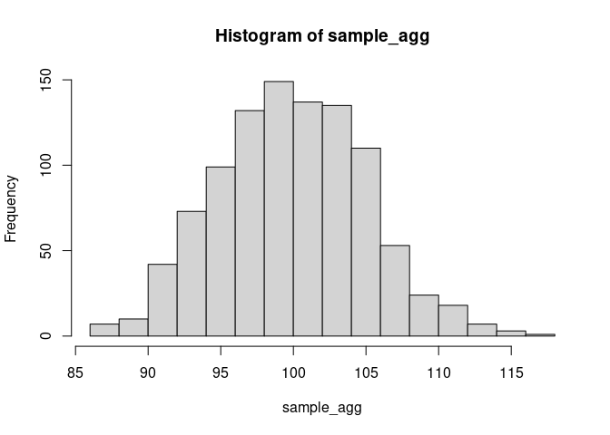

<!-- README.md is generated from README.Rmd. Please edit that file -->

## Installation

<!-- badges: start -->
<!-- badges: end -->

You can install the development version of MaxentDisaggregation from
[GitHub](https://github.com/) with:

``` r
# install.packages("devtools")
devtools::install_github("simschul/MaxentDisaggregation")
```

Note, this package is under constant development. Together with
co-authors, I’m currently preparing a journal article for describing
more of the background of data disaggregation and showing use cases
within the field of Industrial Ecology.

## Background: Uncertainty propagation involving data disaggregation

The goal of MaxentDisaggregation is an R-package that helps you with
uncertainty propagation when data disaggregation is involved. Data
disaggregation usually involves splitting one data point into several
disaggregates using proxy data. It is a common problem in many different
research disciplines.

```{button-link} https://github.com/jakobsarthur/maxent_disaggregation
:color: info
:expand:
💡 For a **Python** implementation of the package click here!
```

<!--  -->


Data disaggregation usually involves an aggregate flow $Y_0$, which is
known, such as the total amount of steel manufactured in a given time
and geography. What we do not know but are interested in are the $K$
disaggregate flows $Y_1,...,Y_K$, such as the different end-use sectors
where the manufactured steel ends up. Even though we do not know the
values of $Y_1, ..., Y_K$, our model structures commonly demands that
the individual $Y_i$’s need to sum to the known aggregate flow $Y_0$ to
respect the mass, energy, stoichiometric or economic balance of the
model

$$
  Y_0 = \sum_{i=1}^{K} Y_i 
$$

This equation, also called an *accounting identity* introduces
dependencies/correlations between the individual disaggregate flows
$Y_i$.

To get estimates for the disaggregate flows, one usually looks for proxy
data. Those proxy data are used to calculate shares (ratios/fractions)
of the respective disaggregate units $x_1, ..., x_K$. To
allocate the entire aggregate flow without leaving any residual (thus to
respect the system balance), those fractions need to sum to one:

$$    \sum_{i=1}^{K} x_i = 1 $$

Disaggregate flows are calculated as

$$ y_i = x_i y_0,  \forall i \in \{1,...,K\}.     $$

## Sampling disaggregates

This package generates a random sample of disaggregates based on the
information provided. The aggregate and the shares are sampled
independently. The distribution from which to sample is determined
internally based on the information provided by the user. This choice of
distribution is mostly based on the principle of Maximum Entropy
(MaxEnt).

The aggregate distribution is determined using the following decision
tree:

<!--  -->


The shares are sampled from different variants of the Dirichlet
distribution:

<!--  -->


## How to use

### Sampling disaggregates

The main function is `rdisagg` which creates a random sample of
disaggregates based on the information provided:

``` r
library(MaxentDisaggregation)
#> Loading required package: truncnorm
#> Loading required package: nloptr
#> Loading required package: gtools
#> Loading required package: data.table
#> 
#> Attaching package: 'MaxentDisaggregation'
#> The following object is masked from 'package:gtools':
#> 
#>     rdirichlet
sample <- rdisagg(n = 1000, mean_0 = 100, sd_0 = 5, min = 0, shares = c(0.1, 0.3, 0.6))
head(sample)
#>           [,1]     [,2]     [,3]
#> [1,] 25.542248 15.44779 54.45482
#> [2,]  2.194530 25.33249 79.60015
#> [3,]  1.481192 16.74706 82.64684
#> [4,] 19.181736 43.81459 45.58907
#> [5,] 18.558886 49.36833 36.33028
#> [6,]  2.633181 38.11875 60.79836
```

We can plot the marginal histograms of the sample:

``` r
hist(sample[,1])
```


``` r
hist(sample[,2])
```


``` r
hist(sample[,3])
```


The samples are consistent with all information provided. Thus, summing
the disaggregate samples should provide an aggregate sample consistent
with the information provided (mean: 100, sd: 5):

``` r
sample_agg <- rowSums(sample)
hist(sample_agg)
```



And indeed:

``` r
cat('Mean: ', mean(sample_agg), '\n')
#> Mean:  99.91481
cat('SD: ', sd(sample_agg))
#> SD:  5.083025
```

### Sampling aggregates and shares seperatedely

With `MaxentDisaggregation` you can also sample the aggregate and the
shares independently using the `ragg` and `rshares` functions:

``` r
sample_agg <- ragg(1000, mean = 100, sd = 5)
hist(sample_agg)
```


``` r
sample_shares <- rshares(1000, shares = c(0.1, 0.3, 0.6))
boxplot(sample_shares)
```


