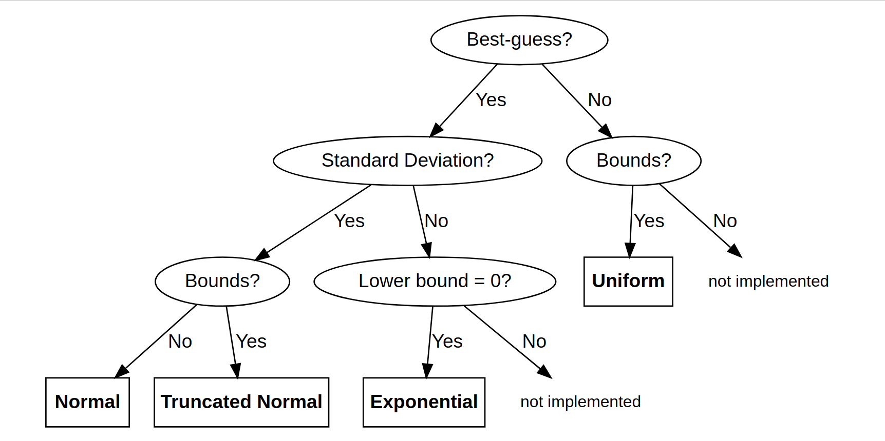
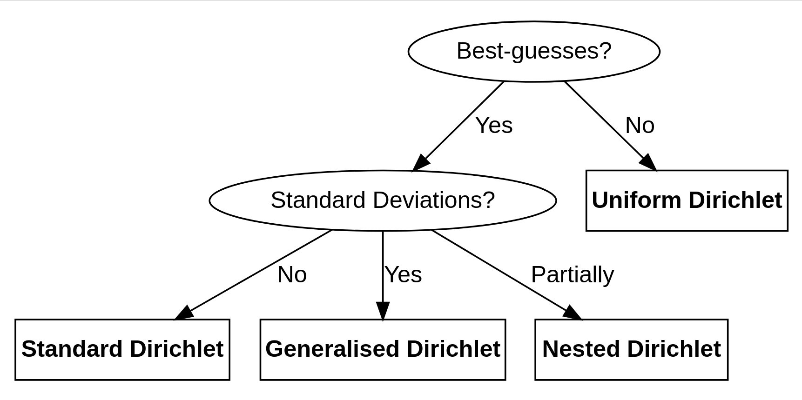

```{r, include = FALSE}
knitr::opts_chunk$set(
collapse = TRUE,
comment = "#>", 
fig.width = 7, 
message = FALSE
)
```


## Introduction

The `MaxentDisaggregation` package provides flexible methods for data disaggregation with uncertainty propagation. This vignette demonstrates how the sampling behavior of `rdisagg()` changes based on the information you provide.

The `rdisagg()` function internally calls two specialized functions:

- `rshares()` - Samples share distributions (how the total is divided)
- `ragg()` - Samples aggregate distributions (the total value)

The package uses decision trees to automatically select appropriate probability distributions based on available information:

1. For the aggregate value: The distribution choice depends on whether you provide mean, standard deviation, minimum and maximum bounds
2. For the shares: The distribution choice depends on whether you provide best estimates and standard deviations

{width=100%}

{width=100%}


```{r, message=FALSE}
library(MaxentDisaggregation)
library(ggplot2)
library(reshape2)
library(data.table)  # For data manipulation
devtools::load_all()

N <- 1E4  # Sample size for demonstrations
```

```{r}
# Define a function to plot histograms
plot_histograms <- function(sample) {
  # Reshape to long data.frame
  sample_df <- reshape2::melt(sample, varnames = c('iteration', 'variable'))
  
  # Plot using ggplot
  ggplot(sample_df, aes(x = value, col = variable, fill = variable)) + 
    geom_histogram(alpha = 0.3, position = 'identity') +
    labs(x = "Value", y = "Frequency") +
    theme_minimal()
}
```

## Sampling Shares

The `rshares()` function samples the relative proportions that must sum to 1. The sampling method depends on what information you provide.

### Uniform Dirichlet Distribution

When no information about shares is available (using `NA`), the function uses a uniform Dirichlet distribution where all components are equally likely:

```{r}
sample_shares1 <- rshares(n = N,
                          shares = c("Var1" = NA, 
                                     "Var2" = NA, 
                                     "Var3" = NA))

plot_histograms(sample_shares1) +
  labs(title = "Uniform Dirichlet Distribution - Equal Probability for All Shares")
```

All three components have similar distributions, reflecting equal probability across all possible share combinations.

### Maximum Entropy Dirichlet Distribution

When you provide best estimates for the shares but no uncertainty information, `rshares()` uses a Maximum Entropy Dirichlet distribution:

```{r}
sample_shares2 <- rshares(n = N,
                          shares = c("Var1" = 0.6, 
                                     "Var2" = 0.3, 
                                     "Var3" = 0.1))

plot_histograms(sample_shares2) +
  labs(title = "Maximum Entropy Dirichlet - Based on Best Estimates Only")
```

This approach provides samples that respect the provided best estimates while maximizing entropy (uncertainty) given the constraints.

### Generalized Dirichlet Distribution

When you provide both best estimates and standard deviations for the shares, `rshares()` uses a generalized Dirichlet distribution:

```{r}
sample_shares3 <- rshares(n = N,
                          shares = c("Var1" = 0.6, 
                                     "Var2" = 0.3, 
                                     "Var3" = 0.1),
                          sds = c("Var1" = 0.01,  # Small uncertainty
                                  "Var2" = 0.02,  # Medium uncertainty
                                  "Var3" = 0.03)) # Larger uncertainty

plot_histograms(sample_shares3) +
  labs(title = "Generalized Dirichlet - With Specified Uncertainties")
```

Note how the distributions reflect the different levels of uncertainty specified for each component.

## Sampling the Aggregate

The `ragg()` function samples the total value to be disaggregated. Different distributions are chosen based on available information.

### Uniform Distribution

When only minimum and maximum bounds are provided:

```{r}
sample_agg1 <- ragg(n = N,
                    min = 0,
                    max = 100)

plot_histograms(data.table(agg = sample_agg1)) +
  labs(title = "Uniform Distribution - Only Bounds Provided")
```

All values between the minimum and maximum are equally likely.

### Normal Distribution

When a mean and standard deviation are provided:

```{r}
sample_agg2 <- ragg(n = N,
                    mean = 10,
                    sd = 5)

plot_histograms(data.table(agg = sample_agg2)) +
  labs(title = "Normal Distribution - Mean and SD Provided")
```

This creates a bell-shaped distribution centered at the specified mean.

### Truncated Normal Distribution

For non-negative variables, you can set a lower bound of zero:

```{r}
sample_agg3 <- ragg(n = N,
                    mean = 10,
                    sd = 5,
                    min = 0)

plot_histograms(data.table(agg = sample_agg3)) +
  labs(title = "Truncated Normal Distribution - With Lower Bound")
```

> **Important:** When using truncated distributions, the sample mean will differ from your specified mean due to the truncation effect. Always check your samples for potential bias!

### Lognormal Distribution

An alternative approach for non-negative variables is using a lognormal distribution:

```{r}
sample_agg4 <- ragg(n = N,
                    mean = 10,
                    sd = 5,
                    log = TRUE)

plot_histograms(data.table(agg = sample_agg4)) +
  labs(title = "Lognormal Distribution - For Non-negative Values")
```

The lognormal distribution is often appropriate for modeling quantities that are naturally skewed (like many environmental and economic variables).

#### When to use Truncated Normal vs. Lognormal

- **Truncated Normal**: When you believe the underlying process follows a normal distribution but negative values are impossible
- **Lognormal**: When the variable naturally exhibits positive skewness (e.g., environmental concentrations, economic figures)

### Exponential Distribution

When only the mean and a lower bound of zero are provided:

```{r}
sample_agg5 <- ragg(n = N,
                    mean = 10,
                    min = 0)

plot_histograms(data.table(agg = sample_agg5)) +
  labs(title = "Exponential Distribution - Mean with Zero Lower Bound")
```

The exponential distribution is characterized by a rapid decline from its peak at the minimum value.

## Using Custom Distributions

If the built-in distributions don't meet your needs, you can generate samples from any distribution and combine them with sampled shares:

```{r}
# Generate aggregate samples from gamma distribution
sample_agg_custom <- rgamma(N, shape = 10, scale = 10)

plot_histograms(data.table(agg = sample_agg_custom)) +
  labs(title = "Custom Gamma Distribution for Aggregate")

# Generate share samples
sample_shares_custom <- rshares(N, 
                               shares = c("Var1" = 0.6,
                                         "Var2" = 0.3, 
                                         "Var3" = 0.1))

# Combine to get disaggregated values
sample_disagg_custom <- sample_shares_custom * sample_agg_custom

plot_histograms(sample_disagg_custom) +
  labs(title = "Disaggregated Values Using Custom Aggregate Distribution")
```

## Conclusion

The `MaxentDisaggregation` package automatically selects appropriate distributions based on the information you provide:

1. For shares:
   - No information → Uniform Dirichlet
   - Best estimates only → Maximum Entropy Dirichlet
   - Best estimates with SDs → Generalized Dirichlet

2. For aggregates:
   - Min/max only → Uniform
   - Mean/SD only → Normal
   - Mean/SD with min → Truncated Normal or Exponential
   - Mean/SD with log=TRUE → Lognormal

This flexibility allows you to incorporate the precise level of information you have available while ensuring statistically valid disaggregation. For complete details on parameter combinations and distribution selection, refer to the package documentation.
