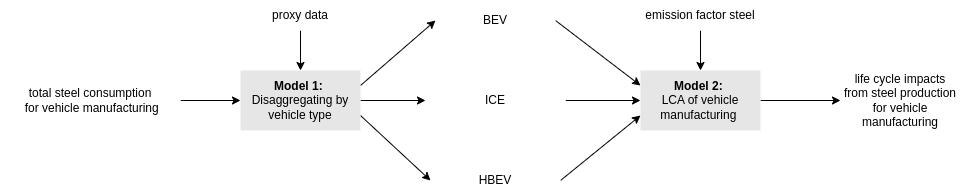

```{r, include = FALSE}
knitr::opts_chunk$set(
  collapse = TRUE,
  comment = "#>", 
  fig.width = 5
)
```


## Introduction

The `MaxentDisaggregation` package enables statistically sound disaggregation of aggregate data with uncertainty propagation. When disaggregating data (splitting a total into components), the components are naturally correlated. These correlations must be properly accounted for in uncertainty analysis to avoid mis-estimating uncertainty in downstream calculations.

This vignette demonstrates how to use `MaxentDisaggregation` through a practical example in Industrial Ecology.

```{r, message=FALSE}
library(MaxentDisaggregation)
library(ggplot2)
library(reshape2)
library(GGally)
library(truncnorm)  # For the rtruncnorm function
devtools::load_all()
```

## Example: Carbon Footprint of Steel in Vehicle Manufacturing

### Problem Statement

An Industrial Ecology researcher has data on total steel consumption for vehicle manufacturing but needs to disaggregate this figure by vehicle type (ICE, BEV, and HBEV) based on production volume proxies. A second researcher will use these disaggregated figures for Life Cycle Assessment (LCA).


{width=100%}

Properly accounting for correlations between the disaggregated values is critical for accurate uncertainty estimation in the LCA.

### Available Information

The researcher has:

1. A best estimate for total steel consumption: 100 tonnes/year
2. An uncertainty estimate for that total: standard deviation of 3 tonnes/year
3. A natural lower bound of 0 (no negative consumption)
4. Proxy-based estimates of shares by vehicle type: ICE (80%), BEV (19%), HBEV (1%)

### Generating Correlated Samples with MaxentDisaggregation

The `rdisagg()` function generates samples that respect all available information:

```{r}
sample <- rdisagg(n = 1E4,        # Sample size
                  mean_0 = 100,    # Best estimate for total
                  sd_0 = 3,        # Standard deviation for total
                  min = 0,         # Lower bound
                  shares = c("ICE" = 0.8,    # Best estimates for shares
                             "BEV" = 0.19, 
                             "HBEV" = 0.01),
                  log = TRUE)      # Use log-normal distribution for sampling
```

The `log = TRUE` parameter means we're assuming a log-normal distribution for the aggregate, which is appropriate for quantities that cannot be negative and may be right-skewed. Setting `log = FALSE` would assume a truncated normal distribution (because of `min = 0`). 

The result is a matrix with three columns (one per vehicle type) and 1,000 rows:

```{r, fig.width=7}
head(sample)

# Visualize the distribution of each component
sample_df <- reshape2::melt(sample, varnames = c('iteration', 'vehicle_type'))
ggplot(sample_df, aes(x = value, col = vehicle_type, fill = vehicle_type)) + 
  geom_histogram(alpha = 0.3, position = 'identity', bins = 100) +
  labs(x = "Steel Consumption (tonnes)", y = "Frequency", 
       title = "Distribution of Steel Consumption by Vehicle Type")
```

### Validating the Samples

Let's verify that our samples are consistent with our input information:

```{r}
# Check if the total matches our specified mean and SD
sample_total <- rowSums(sample)
cat("Mean of the sampled total:", mean(sample_total), "\n")
cat("SD of the sampled total:", sd(sample_total), "\n")

# Check if shares match our specified values
sample_shares <- sample / sample_total
cat("Means of the sampled shares:", colMeans(sample_shares), "\n")
```

### Understanding Correlations in the Sample

Because the components must sum to the total, they are naturally correlated:

```{r, fig.width=6, fig.height=6}
# Visualize correlations
ggpairs(as.data.frame(sample), aes(alpha = 0.1)) +
  labs(title = "Correlations Between Vehicle Type Steel Consumption")
```

The sign and magnitude of correlations depend on the relative uncertainties of the aggregate and shares. With moderate uncertainty in the total (CV = 3%) and high uncertainty in the shares (default Maximum Entropy behavior, see `?rdirichlet_maxent` for more details), we observe negative correlations between components.

If we increase uncertainty in the total while constraining the shares more tightly:

```{r, fig.width=6, fig.height=6}
sample2 <- rdisagg(n = 1E4, 
                   mean_0 = 100, 
                   sd_0 = 50,      # Larger SD for total
                   min = 0, 
                   shares = c("ICE" = 0.8, 
                             "BEV" = 0.19, 
                             "HBEV" = 0.01),
                   sds = c("ICE" = 0.008,    # Small SDs for shares
                           "BEV" = 0.0019, 
                           "HBEV" = 0.0001),
                   log = TRUE)

ggpairs(as.data.frame(sample2), aes(alpha = 0.1)) +
  labs(title = "Correlations with High Total Uncertainty and Low Share Uncertainty")
```

With high uncertainty in the total and low uncertainty in the shares, correlations become positive.

### Downstream Analysis: LCA of Carbon Footprint

Let's examine how these correlations impact a downstream LCA calculation. We assume an emission factor of 2.5 tonnes CO₂ per tonne of steel:

```{r}
emission_factor_steel <- 2.5
```

#### Approach 1: Using Full Samples (With Correlations)

The proper approach is to use the full correlated sample:

```{r}
sample_emissions_full <- sample * emission_factor_steel
total_emissions_full <- rowSums(sample_emissions_full)

cat("Mean emissions:", mean(total_emissions_full), "tonnes CO₂\n")
cat("SD emissions:", sd(total_emissions_full), "tonnes CO₂\n")
cat("CV emissions:", sd(total_emissions_full) / mean(total_emissions_full), "\n")
```

#### Approach 2: Using Summary Statistics Only (Ignoring Correlations)

If researcher 1 only shares summary statistics:

```{r}
result_summary <- list(
  mean = colMeans(sample), 
  sd = apply(sample, 2, sd)
)
print(result_summary)
```

And researcher 2 samples independently from these statistics:

```{r}
# Independent sampling ignoring correlations
sample_steel_by_vehicle_type <- data.frame(
  'ICE' = rtruncnorm(1E4, 
                     a = 0,
                     mean = result_summary$mean[1], 
                     sd = result_summary$sd[1]), 
  'BEV' = rtruncnorm(1E4, 
                     a = 0,
                     mean = result_summary$mean[2], 
                     sd = result_summary$sd[2]), 
  'HBEV' = rtruncnorm(1E4, 
                     a = 0,
                     mean = result_summary$mean[3], 
                     sd = result_summary$sd[3])
)

sample_emissions_univariate <- sample_steel_by_vehicle_type * emission_factor_steel
total_emissions_univariate <- rowSums(sample_emissions_univariate)

cat("Mean emissions:", mean(total_emissions_univariate), "tonnes CO₂\n")
cat("SD emissions:", sd(total_emissions_univariate), "tonnes CO₂\n")
cat("CV emissions:", sd(total_emissions_univariate) / mean(total_emissions_univariate), "\n")
```

#### Comparing Results

Let's compare the uncertainty distributions from both approaches:

```{r, fig.width=7}
comparison_df <- data.frame(
  approach = c(rep("With Correlations", length(total_emissions_full)),
               rep("Independent Sampling", length(total_emissions_univariate))),
  emissions = c(total_emissions_full, total_emissions_univariate)
)

ggplot(comparison_df, aes(x = emissions, fill = approach)) + 
  geom_histogram(alpha = 0.5, position = 'identity') +
  labs(x = "Total Emissions (tonnes CO₂)", y = "Frequency", 
       title = "Impact of Correlations on Uncertainty Estimation")
```

The difference in uncertainty estimates shows why properly accounting for correlations matters. Ignoring correlations typically leads to **overestimating uncertainty** in the final result (wider distribution) when the correlations are negative. 

## Conclusion

The `MaxentDisaggregation` package provides a simple interface for generating statistically valid samples of disaggregated data while properly accounting for correlations. This is crucial for accurate uncertainty propagation in subsequent analyses.

For more complex disaggregation scenarios, see the package documentation on additional parameters for controlling share uncertainties and distribution types.
